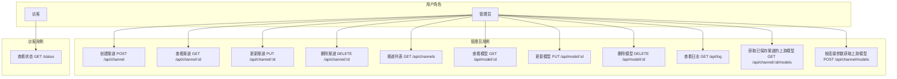
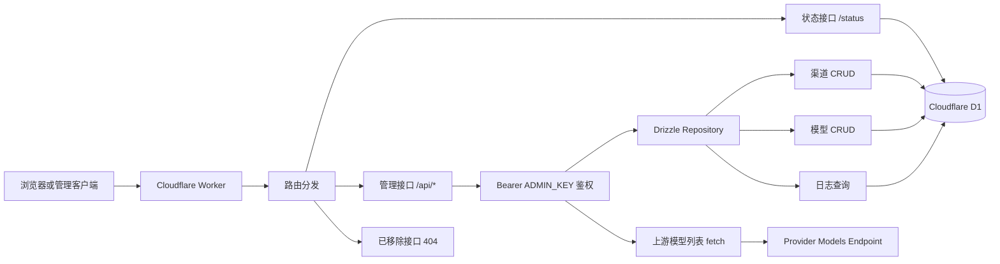
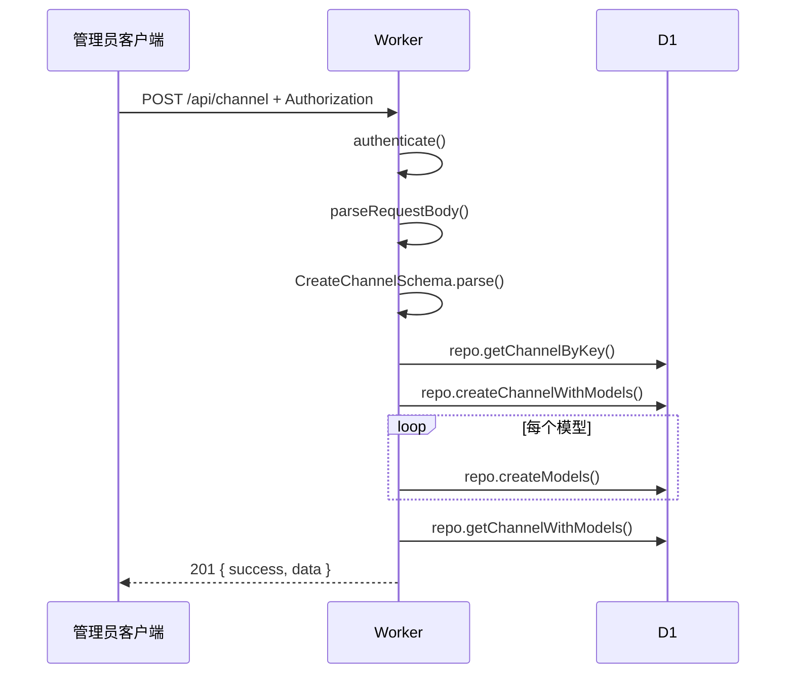
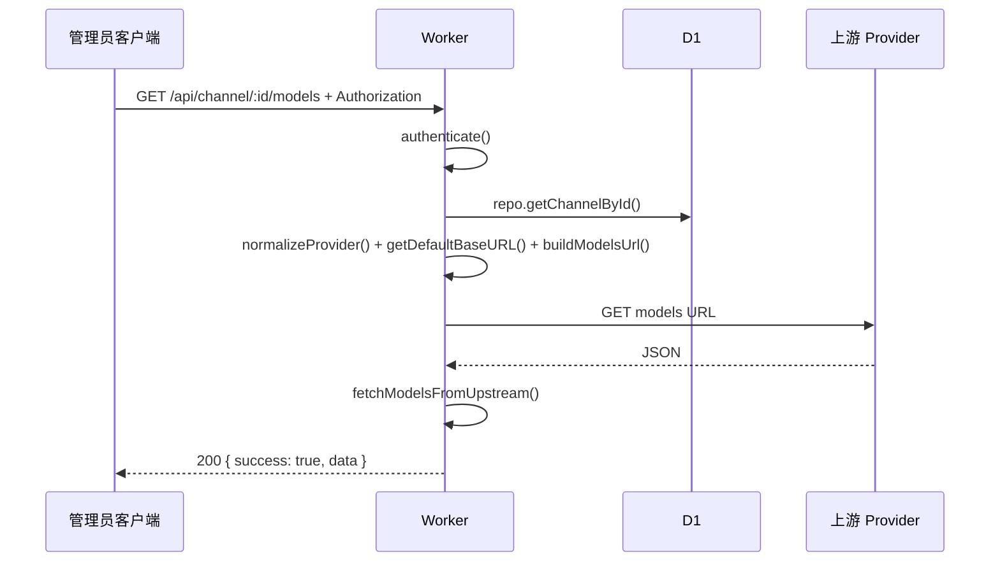
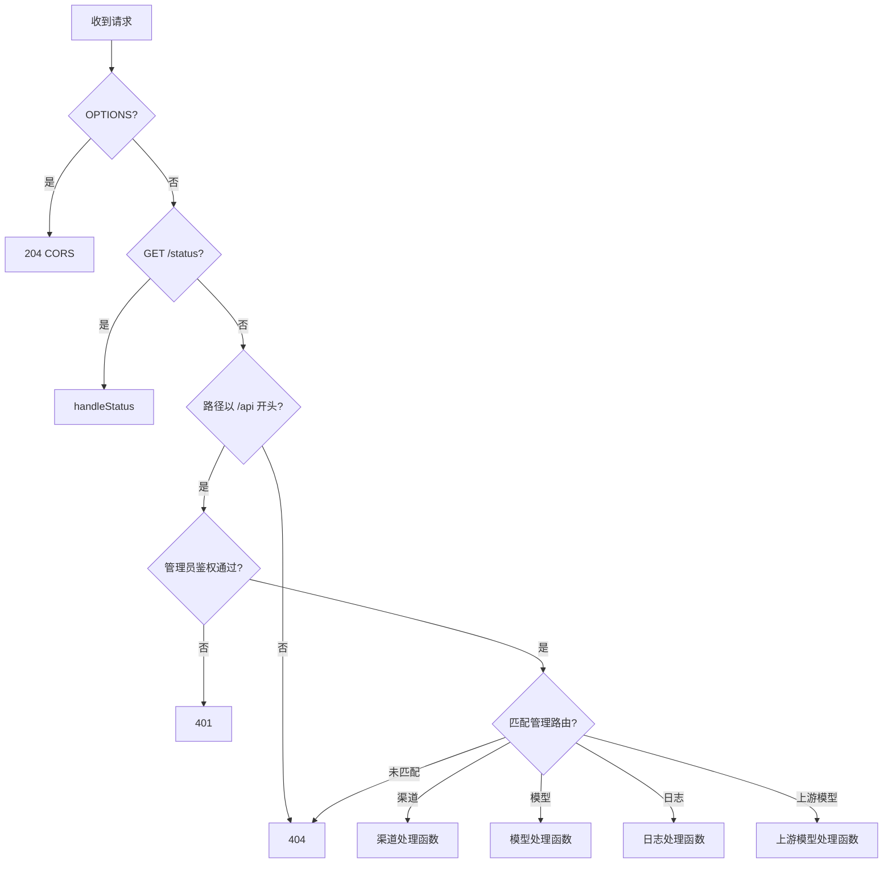

# Open AI Gateway 开发文档

## 1. 项目概述

Open AI Gateway 当前定位为运行在 Cloudflare Workers 上的管理后台服务，用于维护 AI 渠道、渠道模型、历史请求日志和运行状态。面向调用方的模型代理接口已经移除，Worker 不再发起聊天、图片、音频、视频、转写、向量化等模型调用。

**当前能力：**
- 管理渠道：创建、读取、更新、删除渠道配置。
- 管理模型：维护渠道模型、别名、能力、价格、状态、权重和请求头。
- 上游模型列表：通过直接 `fetch` 按 provider/baseURL 获取上游模型列表。
- 状态查看：展示数据库中模型的状态、统计和冷却字段。
- 历史日志查询：分页查询历史 `request_logs` 数据。

**已移除入口：**
- `/v1/*`：全部返回 404，不再存在代理、模型选择、fallback、流式响应、计费写入链路。
- `/api/model/check`：返回 404，不再发起模型可用性检测。

**技术栈：**
- 后端：Cloudflare Workers + Cloudflare D1 + Drizzle ORM + Zod。
- 前端：Vue CDN + TailwindCSS + Fetch API。
- 测试：Node.js Test Runner。

---

## 2. 用户用例图



---

## 3. 系统架构



---

## 4. 时序图

### 4.1 管理员创建渠道



### 4.2 获取上游模型列表



---

## 5. 流程图



---

## 6. 数据结构与表结构

### 6.1 `channels` 表

| 字段 | 类型 | 约束 | 含义、用法和边界 |
|---|---|---|---|
| `id` | TEXT | PRIMARY KEY | 渠道唯一 ID。由 `generateUUID()` 生成，不允许为空。 |
| `name` | TEXT | NOT NULL | 渠道显示名。用于后台展示，长度由 API schema 限制为 1-100。 |
| `key` | TEXT | NOT NULL, UNIQUE | 渠道业务键。仅允许小写字母、数字和短横线，长度 1-50。 |
| `provider` | TEXT | NOT NULL, DEFAULT `openai` | 上游平台标识。用于上游模型列表 URL 和认证方式分支。 |
| `api_key` | TEXT | NOT NULL | 上游 API Key。允许空字符串，但按连接获取模型时必须提供非空值。 |
| `base_url` | TEXT | DEFAULT `''` | 自定义上游基础地址。为空时使用 `getDefaultBaseURL(provider)`。 |
| `weight` | REAL | NOT NULL, DEFAULT `1.0` | 渠道权重，保留为模型配置元数据，范围 0-100。 |
| `created_at` | TEXT | NOT NULL | ISO 时间字符串。创建渠道时写入。 |
| `updated_at` | TEXT | NOT NULL | ISO 时间字符串。更新渠道时写入。 |

### 6.2 `channel_models` 表

| 字段 | 类型 | 约束 | 含义、用法和边界 |
|---|---|---|---|
| `id` | TEXT | PRIMARY KEY | 模型唯一 ID。由 `generateUUID()` 生成。 |
| `channel_id` | TEXT | NOT NULL, FK | 所属渠道 ID。删除渠道时同步删除模型。 |
| `code` | TEXT | NOT NULL | 上游模型代码。创建时必填，更新时可选。 |
| `name` | TEXT | NOT NULL | 模型显示名。创建时必填，更新时可选。 |
| `desc` | TEXT | DEFAULT `''` | 模型说明。允许空字符串。 |
| `aliases` | TEXT | DEFAULT `[]` | JSON 字符串数组。用于后台展示和历史兼容，不再用于代理路由。 |
| `call_type` | TEXT | NOT NULL, DEFAULT `chat` | 模型调用类型元数据。允许值见 `CALL_TYPES`。 |
| `capabilities` | TEXT | DEFAULT `["chat"]` | JSON 字符串数组。表示模型能力标签。 |
| `input_price` | TEXT | DEFAULT `0` | 输入价格配置文本。历史统计展示保留。 |
| `output_price` | TEXT | DEFAULT `0` | 输出价格配置文本。历史统计展示保留。 |
| `status` | TEXT | NOT NULL, DEFAULT `active` | 模型状态。允许 `active`、`open`、`disable`。 |
| `weight` | REAL | NOT NULL, DEFAULT `1.0` | 模型权重，范围 0-100。 |
| `avg_latency_ms` | REAL | NOT NULL, DEFAULT `0.0` | 历史平均延迟毫秒数。当前版本不再主动写入。 |
| `success_rate` | REAL | NOT NULL, DEFAULT `1.0` | 历史成功率，范围 0-1。当前版本不再主动写入。 |
| `error_rate` | REAL | NOT NULL, DEFAULT `0.0` | 历史错误率，范围 0-1。当前版本不再主动写入。 |
| `consecutive_failures` | INTEGER | NOT NULL, DEFAULT `0` | 历史连续失败次数。当前版本不再主动写入。 |
| `cooldown_until` | TEXT | NULL | 历史冷却结束时间。当前版本不再主动写入。 |
| `request_count` | INTEGER | NOT NULL, DEFAULT `0` | 历史请求次数。当前版本不再主动写入。 |
| `input_usage` | INTEGER | NOT NULL, DEFAULT `0` | 历史输入用量。当前版本不再主动写入。 |
| `outpu_usage` | INTEGER | NOT NULL, DEFAULT `0` | 历史输出用量。字段名保留数据库现状。 |
| `total_cost` | INTEGER | NOT NULL, DEFAULT `0` | 历史总成本，按十亿倍缩放保存。当前版本不再主动写入。 |
| `last_updated` | TEXT | NOT NULL | 模型最后更新时间。 |
| `headers` | TEXT | DEFAULT `{}` | JSON 对象字符串。保存模型级请求头元数据。 |

### 6.3 `request_logs` 表

| 字段 | 类型 | 约束 | 含义、用法和边界 |
|---|---|---|---|
| `id` | TEXT | PRIMARY KEY | 日志唯一 ID。 |
| `channel_id` | TEXT | NOT NULL | 渠道 ID。 |
| `channel_name` | TEXT | NOT NULL | 记录时渠道名。 |
| `model_id` | TEXT | NOT NULL | 模型 ID。 |
| `model_code` | TEXT | NOT NULL | 模型代码。 |
| `call_type` | TEXT | NOT NULL | 历史调用类型。 |
| `request_model` | TEXT | NOT NULL | 历史请求中的模型标识。 |
| `status` | TEXT | NOT NULL | `success` 或 `error`。 |
| `error_message` | TEXT | DEFAULT `''` | 错误信息，成功日志为空。 |
| `latency_ms` | INTEGER | NOT NULL, DEFAULT `0` | 历史延迟。 |
| `input_quantity` | INTEGER | DEFAULT `0` | 历史输入计费数量。 |
| `output_quantity` | INTEGER | DEFAULT `0` | 历史输出计费数量。 |
| `input_price` | TEXT | DEFAULT `0` | 历史输入价格。 |
| `output_price` | TEXT | DEFAULT `0` | 历史输出价格。 |
| `input_cost` | INTEGER | DEFAULT `0` | 历史输入成本。 |
| `output_cost` | INTEGER | DEFAULT `0` | 历史输出成本。 |
| `total_cost` | INTEGER | DEFAULT `0` | 历史总成本。 |
| `created_at` | TEXT | NOT NULL | 日志创建时间。 |

---

## 7. TypeScript 风格数据结构

```ts
type Provider =
  | 'openai'
  | 'openai-compatible'
  | 'google'
  | 'gemini'
  | 'anthropic'
  | 'claude'
  | 'openrouter'
  | 'pollinations'
  | 'exacg'
  | 'microsoft-tts';

type CallType = 'chat' | 'mix' | 'image_gen' | 'audio_gen' | 'video_gen' | 'transcribe' | 'embedding';
type ModelStatus = 'active' | 'open' | 'disable';
type LogStatus = 'success' | 'error';

interface ChannelModelInput {
  code: string;              // 上游模型代码，创建时必填
  name: string;              // 后台显示名，创建时必填
  desc: string;              // 模型描述，默认空字符串
  aliases: string[];         // 别名列表，去重由前端处理，后端存 JSON
  callType: CallType;        // 调用类型元数据，默认 chat
  capabilities: string[];    // 能力标签，默认 ['chat']
  inputPrice: string;        // 输入价格文本，默认 '0'
  outputPrice: string;       // 输出价格文本，默认 '0'
  weight: number;            // 模型权重，0-100，默认 1
  headers: Record<string, string>; // 模型级请求头元数据
}

interface CreateChannelInput {
  name: string;              // 渠道名，1-100 字符
  key: string;               // 唯一键，正则 /^[a-z0-9-]+$/
  provider: Provider;        // 上游 provider，默认 openai
  apiKey: string;            // 上游密钥，可为空字符串
  baseURL: string;           // 上游基础 URL 或空字符串
  weight: number;            // 渠道权重，0-100
  models: ChannelModelInput[]; // 同步创建的模型列表
}

interface UpstreamModel {
  id: string;                // 上游模型 ID
  object: string;            // 上游对象类型，缺省 model
  created: number;           // 上游创建时间戳，缺省 0
  owned_by: string;          // 所属方，缺省 unknown
}

interface ModelSelectionInput {
  model: string;             // 用户请求的模型标识，可匹配 channel_models.code 或 aliases
  callType: CallType;        // 用户请求的调用类型；只返回相同 call_type 或 mix 模型
  channelId?: string;        // 可选渠道 ID；传入时只在该渠道内选择
  now?: Date;                // 当前时间；用于过滤 cooldown_until，默认 new Date()
}

interface SelectedChannelModel {
  channel: {
    id: string;              // 渠道 ID
    name: string;            // 渠道名称
    key: string;             // 渠道 key
    provider: Provider;      // 渠道 provider
    api_key: string;         // 渠道 API Key
    base_url: string;        // 渠道 base URL
  };
  model: Record<string, unknown>; // channel_models 行，保留原始统计字段
  score: number;             // 选择分数，值越高越优先
}

interface CallResultInput {
  requestBody: Record<string, unknown>; // 原始请求体；至少包含可选 model 字段
  responseBody?: Record<string, unknown>; // 成功响应体；用于提取 usage/media 计费用量
  selection: SelectedChannelModel;       // 本次实际使用的渠道和模型
  callType: CallType;                    // 本次调用类型
  latencyMs: number;                     // 本次调用耗时，非负毫秒数
  error?: unknown;                       // 失败对象；优先读取 error.message
  now?: Date;                            // 写日志和统计更新时间，默认当前时间
  uuid?: () => string;                   // 日志 ID 生成函数，默认 crypto.randomUUID
}

interface RequestLogEntry {
  channel_id: string;       // 渠道 ID
  channel_name: string;     // 渠道名称
  model_id: string;         // 模型 ID
  model_code: string;       // 模型 code
  call_type: CallType;      // 调用类型
  request_model: string;    // 请求模型标识，优先 requestBody.model
  status: LogStatus;        // success 或 error
  error_message: string;    // 失败信息，成功为空字符串
  latency_ms: number;       // 调用耗时
  input_quantity: number;   // 输入计费用量
  output_quantity: number;  // 输出计费用量
  input_price: string;      // 命中的输入价格规则
  output_price: string;     // 命中的输出价格规则
  input_cost: number;       // 输入成本，按十亿倍缩放
  output_cost: number;      // 输出成本，按十亿倍缩放
  total_cost: number;       // 总成本，按十亿倍缩放
}
```

---

## 8. 函数签名

### 8.1 Drizzle 数据库模块

```ts
// db-schema.js
const channels: SQLiteTable;       // channels 表定义，字段保持数据库 snake_case
const channelModels: SQLiteTable;  // channel_models 表定义，字段保持数据库 snake_case
const requestLogs: SQLiteTable;    // request_logs 表定义，字段保持数据库 snake_case

// db-repository.js
function createGatewayRepository(d1: D1Database): {
  getChannelById(id: string): Promise<ChannelRow | null>;
  getChannelByKey(key: string): Promise<ChannelRow | null>;
  getModelsByChannelId(channelId: string): Promise<ChannelModelRow[]>;
  createChannelWithModels(input: {
    channel: ChannelRow;
    models: ChannelModelInput[];
    modelIds: string[];
    timestamp: string;
  }): Promise<void>;
  createModels(channelId: string, models: ChannelModelInput[], modelIds: string[], timestamp: string): Promise<void>;
  getChannelWithModels(id: string): Promise<(ChannelRow & { models: ChannelModelRow[] }) | null>;
  listChannelsWithModels(pagination: { page: number; limit: number }): Promise<{ data: Array<ChannelRow & { models: ChannelModelRow[] }>; total: number }>;
  updateChannel(id: string, updates: Partial<ChannelRow>): Promise<void>;
  deleteChannel(id: string): Promise<void>;
  getModelById(id: string): Promise<ChannelModelRow | null>;
  getModelsByCode(code: string, channelId?: string): Promise<ChannelModelRow[]>;
  updateModelById(id: string, updates: Partial<ChannelModelRow>): Promise<void>;
  updateModelsByCode(code: string, updates: Partial<ChannelModelRow>, channelId?: string): Promise<ChannelModelRow[]>;
  deleteModelById(id: string): Promise<void>;
  deleteModelsByCode(code: string, channelId?: string): Promise<number>;
  getLogs(query: LogQuery): Promise<{ data: RequestLogRow[]; total: number }>;
  getStatusRows(): Promise<Array<ChannelModelRow & { channel_name: string; provider: string }>>;
};
```

Drizzle 使用边界：
- `worker.js` 不直接持有 SQL 字符串，也不直接调用 `prepare().bind()`。
- 表字段命名保持数据库现状，避免前后端响应字段变化。
- 迁移文件仍保留 SQL 作为 D1 schema 来源；运行时查询通过 Drizzle 完成。

### 8.2 模型选择模块 `model-selection.js`

```ts
const SCORE_WEIGHTS: {
  WEIGHT_FACTOR: 10;         // 模型权重乘数
  CHANNEL_WEIGHT_FACTOR: 10; // 渠道权重乘数
  SUCCESS_RATE_FACTOR: 50;   // 成功率乘数
  LATENCY_PENALTY: 0.01;     // 平均延迟惩罚
  FAILURE_PENALTY: 20;       // 连续失败惩罚
};

function calculateModelScore(modelRow: {
  weight: number;
  ch_weight?: number;
  success_rate: number;
  avg_latency_ms: number;
  consecutive_failures: number;
}): number;

async function selectChannelModels(
  db: D1Database,
  options: ModelSelectionInput
): Promise<SelectedChannelModel[]>;
```

选择规则：
- `model` 匹配 `channel_models.code` 或 `channel_models.aliases`。
- 排除 `status = disable` 的模型。
- 排除 `cooldown_until >= now` 的模型。
- 只保留 `call_type = callType` 或 `call_type = mix` 的模型。
- 按 `calculateModelScore()` 从高到低排序。
- `channelId` 有值时，只在指定渠道中选择。

### 8.3 调用结果处理模块 `call-result.js`

```ts
const COST_UNITS: {
  REQUEST: '/req';          // 按请求次数计费
  IMAGE: '/img';            // 按输出图片数计费
  SECOND: '/sec';           // 按音频/视频秒数计费
  MILLION: '/M';            // 按 token 计费，配置写法兼容 /M 和 /m
};

const COST_SCALE_FACTOR: 1000000000; // 成本整数缩放倍数
const EMA_ALPHA: 0.3;                // 成功率、错误率、延迟 EMA 更新系数

function buildSuccessLogEntry(input: CallResultInput): RequestLogEntry;
function buildFailureLogEntry(input: CallResultInput): RequestLogEntry;
function getCooldownDuration(failures: number): number;

async function recordCallSuccess(
  db: D1Database,
  input: CallResultInput
): Promise<RequestLogEntry>;

async function recordCallFailure(
  db: D1Database,
  input: CallResultInput
): Promise<RequestLogEntry>;
```

成功处理规则：
- 根据 `responseBody.usage` 读取 token 用量，兼容 `inputTokens/outputTokens` 和 `promptTokens/completionTokens`。
- 根据模型 `input_price/output_price` 选择最适合当前输出类型的价格规则。
- 写入 `request_logs` 成功日志。
- 更新模型统计：平均延迟、成功率、错误率、连续失败数、冷却时间、请求次数、输入/输出用量、总成本。

失败处理规则：
- 写入 `request_logs` 失败日志，计费用量和成本为 0。
- 增加连续失败次数，按失败次数计算冷却时间。
- 使用 EMA 更新成功率和错误率，并增加请求次数。

### 8.4 通用工具函数

```ts
function generateUUID(): string;
function applyCors(response: Response): Response;
function jsonResponse(data: unknown, status?: number): Response;
function errorResponse(message: string, status?: number): Response;
function handleCorsPreflightRequest(): Response;
function parsePagination(url: URL): { page: number; limit: number };
function parseModelBatchOptions(request: Request): { syncScope: 'single' | 'by_code'; channelId: string };
function buildCodeScopedCondition(channelId: string, startIndex?: number): { suffix: string; params: string[] };
async function parseRequestBody(request: Request): Promise<{ success: true; body: unknown } | { success: false; error: string }>;
function buildModelInsertBindings(modelId: string, channelId: string, model: ChannelModelInput, timestamp: string): unknown[];
function invalidRequestBodyResponse(parseErrorMessage?: string): Response;
function formatValidationError(error: unknown): string;
function buildModelsUrl(baseURL: string): string;
function extractBearerToken(request: Request): string | null;
function extractPathParam(pathname: string, prefix: string): string | null;
function buildPaginatedResponse<T>(data: T[], total: number, pagination: { page: number; limit: number }): { data: T[]; total: number; page: number; limit: number; total_pages: number };
function normalizeProvider(provider: string): string;
function nowIso(nowFn: () => Date): string;
async function depsFetch(input: RequestInfo | URL, init?: RequestInit): Promise<Response>;
async function getRequestBody(body: BodyInit | null | undefined): Promise<string>;
```

### 8.5 应用工厂与路由函数

```ts
function createApp(deps?: {
  now?: () => Date;
  uuid?: () => string;
  fetch?: typeof fetch;
  repository?: ReturnType<typeof createGatewayRepository>;
}): {
  fetch(request: Request, env: Env, ctx?: ExecutionContext): Promise<Response>;
  handleRequest(request: Request, env: Env, ctx?: ExecutionContext): Promise<Response>;
  routeRequest(request: Request, env: Env, ctx?: ExecutionContext): Promise<Response>;
  authenticate(request: Request, env: Env): boolean;
  isAdmin(request: Request, env: Env): boolean;
  routeAdminApi(request: Request, env: Env): Promise<Response>;
  handleCreateChannel(request: Request, env: Env): Promise<Response>;
  handleGetChannel(channelId: string, env: Env, status?: number, extra?: Record<string, unknown>): Promise<Response>;
  handleUpdateChannel(channelId: string, request: Request, env: Env): Promise<Response>;
  handleDeleteChannel(channelId: string, env: Env): Promise<Response>;
  handleListChannels(request: Request, env: Env): Promise<Response>;
  handleGetModel(modelId: string, env: Env): Promise<Response>;
  handleUpdateModel(modelId: string, request: Request, env: Env): Promise<Response>;
  handleDeleteModel(modelId: string, request: Request, env: Env): Promise<Response>;
  handleGetLogs(request: Request, env: Env): Promise<Response>;
  handleStatus(env: Env): Promise<Response>;
  handleGetChannelModels(channelId: string, env: Env): Promise<Response>;
  handleGetChannelModelsByConnection(request: Request, env: Env): Promise<Response>;
  getChannelModels(channel: ChannelConnection, env: Env): Promise<Response>;
  fetchUpstreamModels(channel: ChannelConnection, env: Env): Promise<UpstreamModel[]>;
  fetchModelsFromUpstream(url: string, headers: Record<string, string>, env: Env): Promise<UpstreamModel[]>;
  getDefaultBaseURL(provider: string): string;
};
```

---

## 9. API 输入输出说明

所有 `/api/*` 接口都需要 `Authorization: Bearer {ADMIN_KEY}`。`/status` 不需要鉴权。所有响应都会带 CORS header。

### `GET /status`

**输出：**
```json
{
  "models": [
    {
      "code": "gpt-4o",
      "name": "GPT-4o",
      "status": "active",
      "channel_name": "OpenAI",
      "provider": "openai",
      "call_type": "chat",
      "success_rate": 1,
      "avg_latency_ms": 0,
      "consecutive_failures": 0,
      "cooldown_until": null,
      "request_count": 0,
      "input_usage": 0,
      "outpu_usage": 0,
      "total_cost": 0
    }
  ]
}
```

### `GET /api/channels?page=1&limit=20`

**输出：**
```json
{
  "data": [{ "id": "channel-id", "name": "OpenAI", "models": [] }],
  "total": 1,
  "page": 1,
  "limit": 20,
  "total_pages": 1
}
```

### `POST /api/channel`

**输入：** `CreateChannelInput`

**输出：**
```json
{ "success": true, "data": { "id": "channel-id", "models": [] } }
```

### `GET /api/channel/:id`

**输出：**
```json
{ "success": true, "data": { "id": "channel-id", "models": [] } }
```

### `PUT /api/channel/:id`

**输入：** `Partial<CreateChannelInput> & { deletedModelIds?: string[] }`

**输出：**
```json
{
  "success": true,
  "data": { "id": "channel-id", "models": [] },
  "model_changes": {
    "updated_count": 1,
    "created_count": 1,
    "skipped": [],
    "deleted_count": 0,
    "delete_skipped": []
  }
}
```

### `DELETE /api/channel/:id`

**输出：**
```json
{ "success": true }
```

### `GET /api/model/:id`

**输出：**
```json
{ "success": true, "data": { "id": "model-id", "code": "gpt-4o" } }
```

### `PUT /api/model/:id?sync_scope=single|by_code&channel_id=optional`

**输入：** `Partial<ChannelModelInput>`

**输出：**
```json
{
  "success": true,
  "data": { "id": "model-id", "code": "gpt-4o" },
  "affected": { "scope": "single", "channel_id": "", "count": 1 }
}
```

### `DELETE /api/model/:id?sync_scope=single|by_code&channel_id=optional`

**输出：**
```json
{ "success": true, "affected": { "scope": "single", "channel_id": "", "count": 1 } }
```

### `GET /api/log?page=1&limit=20&status=error&channel_key=openai&model_code=gpt-4o`

**输出：**
```json
{
  "data": [],
  "total": 0,
  "page": 1,
  "limit": 20,
  "total_pages": 1
}
```

### `GET /api/channel/:id/models`

按已保存渠道配置获取上游模型列表。Anthropic、Exacg、Microsoft TTS 当前没有公开模型列表，返回空数组。

**输出：**
```json
{
  "success": true,
  "data": [
    { "id": "gpt-4o", "object": "model", "created": 1700000000, "owned_by": "openai" }
  ]
}
```

### `POST /api/channel/models`

**输入：**
```json
{
  "provider": "openai",
  "apiKey": "sk-...",
  "baseURL": ""
}
```

**输出：**
```json
{
  "success": true,
  "data": [
    { "id": "gpt-4o", "object": "model", "created": 1700000000, "owned_by": "openai" }
  ]
}
```

### 已移除接口

以下入口必须返回 404：

```text
GET/POST/PUT/DELETE /v1/*
POST /api/model/check
```

---

## 10. 伪代码

### 10.1 请求入口

```text
handleRequest(request, env, ctx):
  if request.method == OPTIONS:
    return CORS 204
  try:
    response = routeRequest(request, env, ctx)
    return applyCors(response)
  catch error:
    log error
    return 500 JSON
```

### 10.2 管理路由

```text
routeAdminApi(request, env):
  if authenticate(request, env) is false:
    return 401

  if GET /api/channels:
    return handleListChannels()
  if POST /api/channel:
    return handleCreateChannel()
  if POST /api/channel/models:
    return handleGetChannelModelsByConnection()
  if GET /api/channel/:id/models:
    return handleGetChannelModels()
  if /api/channel/:id:
    dispatch GET/PUT/DELETE
  if /api/model/:id:
    dispatch GET/PUT/DELETE
  if GET /api/log:
    return handleGetLogs()
  return 404
```

### 10.3 上游模型列表

```text
fetchUpstreamModels(channel, env):
  provider = normalizeProvider(channel.provider)
  if provider has no public models endpoint:
    return []
  baseURL = channel.base_url or getDefaultBaseURL(provider)
  url = buildModelsUrl(baseURL)
  headers = { content-type: application/json }
  if provider == google:
    append key query parameter
  else:
    set Authorization Bearer header
  return fetchModelsFromUpstream(url, headers, env)
```

### 10.4 模型选择

```text
selectChannelModels(db, options):
  nowValue = options.now or current date
  query rows where:
    code equals options.model OR aliases contains options.model
    status is not disable
    cooldown_until is null OR cooldown_until is before nowValue
    if options.channelId exists, channel_id equals options.channelId

  matched = rows where call_type equals options.callType OR call_type equals mix
  for each row in matched:
    score =
      model.weight * 10
      + channel.weight * 10
      + success_rate * 50
      - avg_latency_ms * 0.01
      - consecutive_failures * 20
    return { channel, model, score }

  sort selections by score descending
```

### 10.5 调用结果处理

```text
recordCallSuccess(db, input):
  entry = buildSuccessLogEntry(input)
  write entry into request_logs
  model = select channel_models by entry.model_id
  if model exists:
    avg_latency_ms = old_avg * 0.7 + entry.latency_ms * 0.3
    success_rate = old_success_rate * 0.7 + 1 * 0.3
    error_rate = 1 - success_rate
    consecutive_failures = 0
    cooldown_until = null
    status = active
    request_count += 1
    input_usage += entry.input_quantity
    outpu_usage += entry.output_quantity
    total_cost += entry.total_cost
  return entry

recordCallFailure(db, input):
  entry = buildFailureLogEntry(input)
  write entry into request_logs
  model = select channel_models by entry.model_id
  if model exists:
    consecutive_failures += 1
    success_rate = old_success_rate * 0.7
    error_rate = 1 - success_rate
    cooldown_until = now + getCooldownDuration(consecutive_failures)
    status = open when cooldown exists, otherwise keep old status
    request_count += 1
  return entry
```
