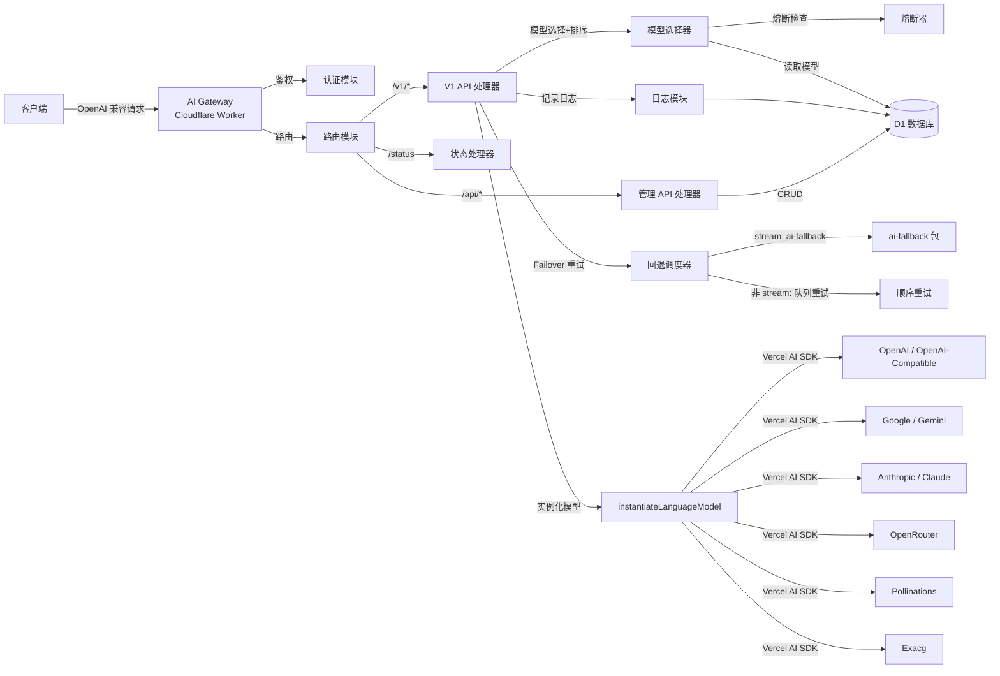
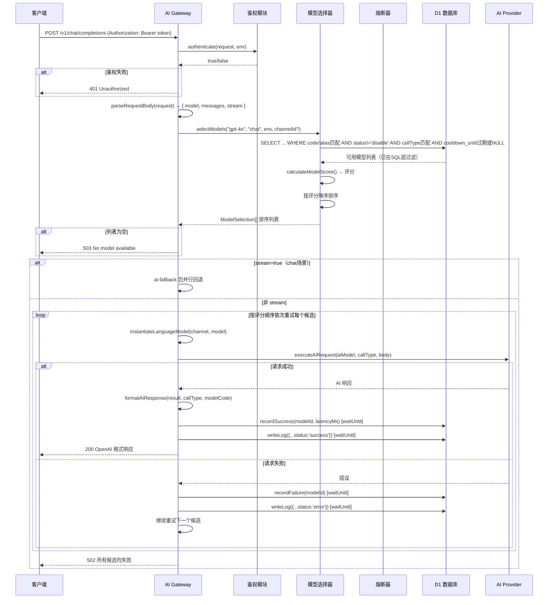
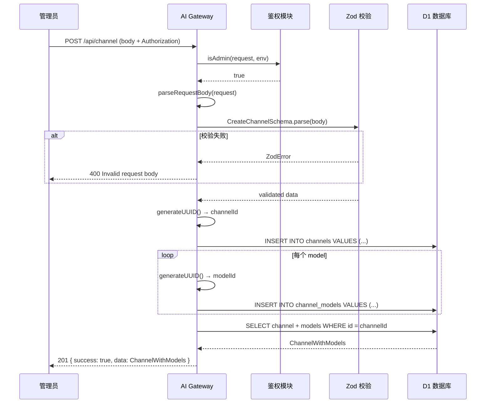
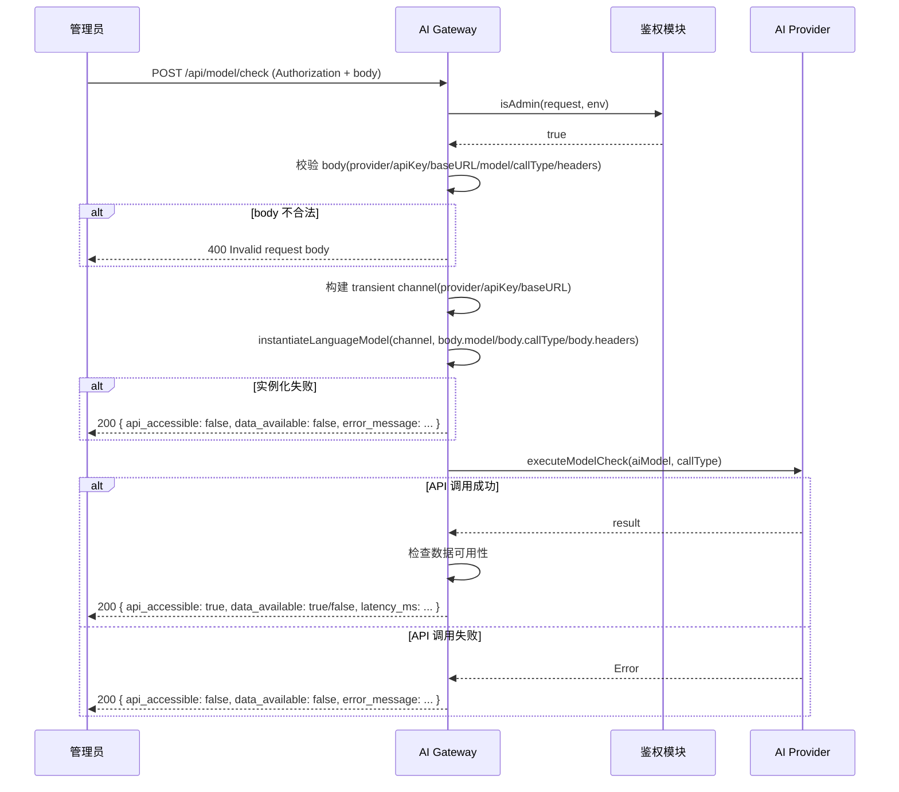
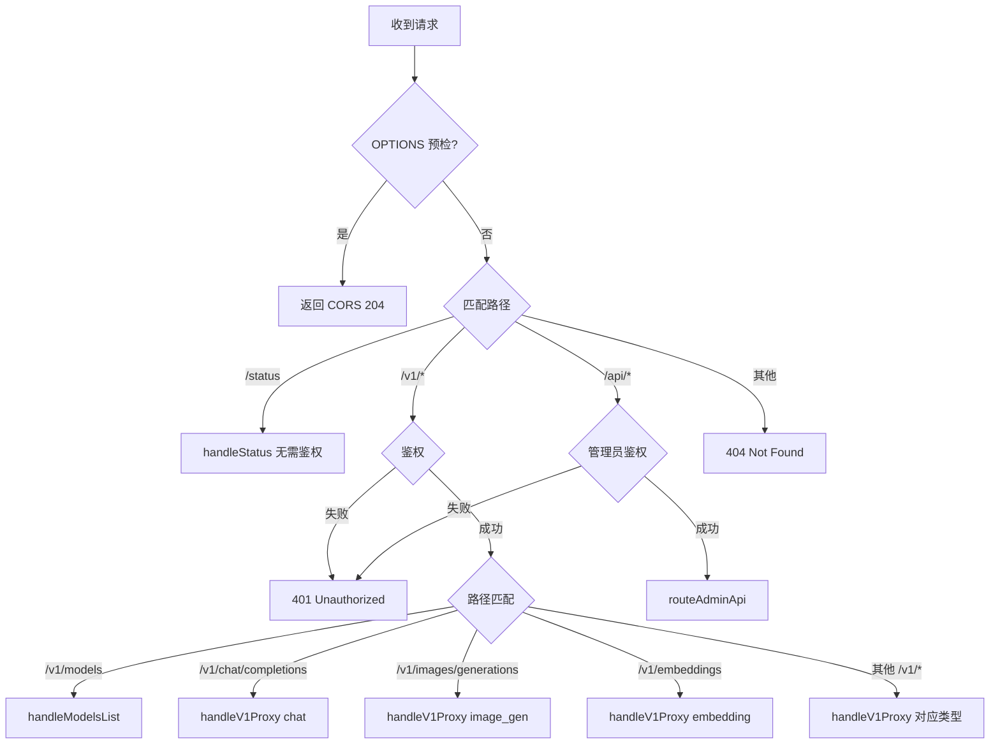
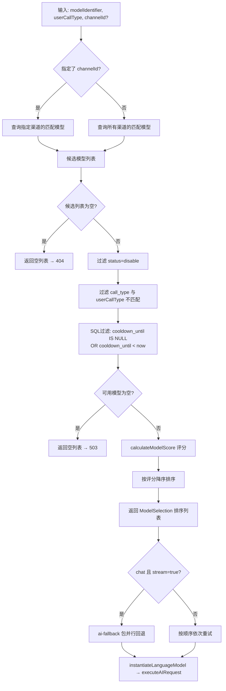
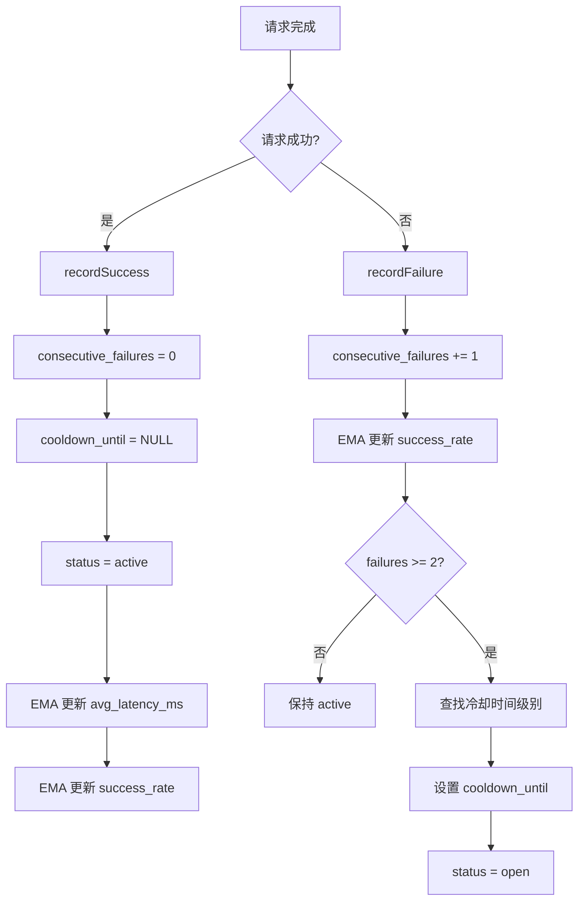
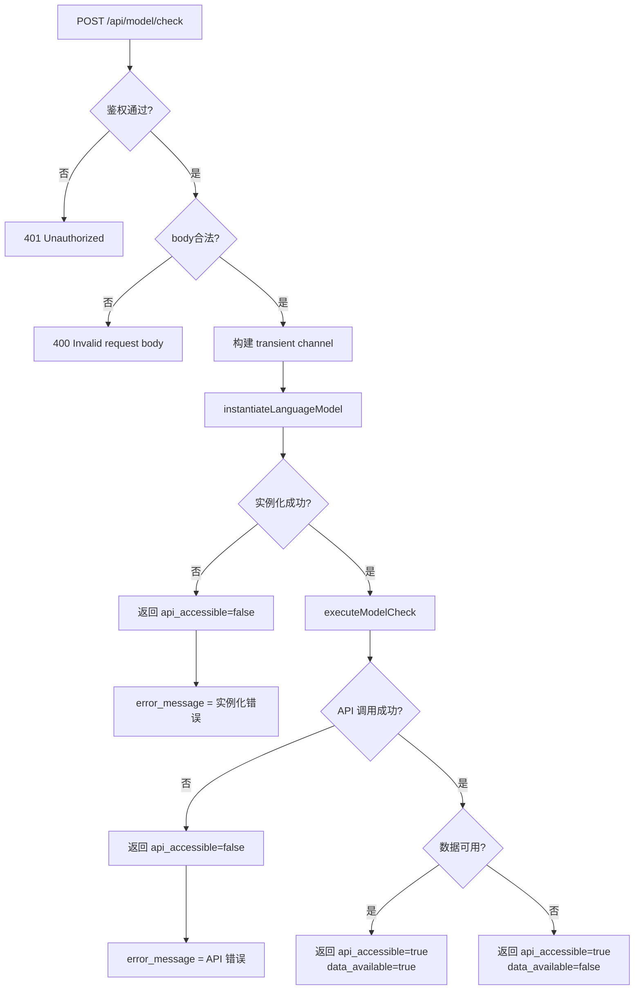

# Open AI Gateway 开发文档

## 1. 项目概述

Open AI Gateway 是一个运行在 Cloudflare Workers 上的 AI 网关服务，提供统一的 OpenAI 兼容 API 接口，将请求智能路由到不同的 AI 平台（OpenAI、Google Gemini、Anthropic Claude、OpenRouter、Pollinations、Exacg、Microsoft TTS）。

**核心能力：**
- 统一 API：所有 AI 平台通过 OpenAI `/v1/*` 格式统一调用
- 智能路由：基于权重、延迟、成功率的模型选择算法
- 渠道回退（Failover）：按评分排序依次重试，stream 场景使用 ai-fallback 包
- 熔断器：自动检测故障模型并执行冷却隔离
- 多接口支持：聊天、图片生成、视频生成、语音生成、语音识别、向量化
- 管理后台：渠道/模型的 CRUD 管理、请求日志查询

**技术栈：**
- 后端：Cloudflare Workers + Vercel AI SDK + Cloudflare D1 + Zod
- 前端：Vue CDN + TailwindCSS + Fetch API
- 测试：Node.js Test Runner

---

## 2. 用例图

```mermaid
graph TB
    subgraph 用户角色
        U[API 调用者]
        A[管理员]
        V[访客]
    end

    subgraph API 调用者用例
        UC1[发起聊天请求 /v1/chat/completions]
        UC2[生成图片 /v1/images/generations]
        UC3[生成视频 /v1/video/generations]
        UC4[生成语音 /v1/audio/speech]
        UC5[语音识别 /v1/audio/transcriptions]
        UC6[向量化 /v1/embeddings]
        UC7[获取模型列表 /v1/models]
        UC8[指定渠道请求 x-channel-id]
    end

    subgraph 管理员用例
        AC1[创建渠道 POST /api/channel]
        AC2[查看渠道 GET /api/channel/:id]
        AC3[更新渠道 PUT /api/channel/:id]
        AC4[删除渠道 DELETE /api/channel/:id]
        AC5[渠道列表 GET /api/channels]
        AC6[查看模型 GET /api/model/:id]
        AC7[更新模型 PUT /api/model/:id]
        AC8[删除模型 DELETE /api/model/:id]
        AC9[查看日志 GET /api/log]
        AC10[获取渠道模型列表 POST /api/channel/models]
        AC11[检测模型可用性 POST /api/model/check]
    end

    subgraph 访客用例
        VC1[查看状态 GET /status]
    end

    U --> UC1 & UC2 & UC3 & UC4 & UC5 & UC6 & UC7 & UC8
    A --> AC1 & AC2 & AC3 & AC4 & AC5 & AC6 & AC7 & AC8 & AC9 & AC10 & AC11
    V --> VC1
```



---

## 3. 系统架构



---

## 4. 数据结构与表结构

### 4.1 D1 数据库表

#### `channels` 表 — AI 渠道

| 字段 | 类型 | 约束 | 说明 |
|------|------|------|------|
| `id` | TEXT | PRIMARY KEY | 渠道唯一标识，UUID v4 格式 |
| `name` | TEXT | NOT NULL | 渠道显示名称，如 "OpenAI 官方"，用于管理界面展示 |
| `key` | TEXT | NOT NULL, UNIQUE | 渠道唯一标识键，如 "openai-official"，用于程序内部引用，仅允许 `[a-z0-9-]` |
| `provider` | TEXT | NOT NULL, DEFAULT 'openai' | AI 平台标识。取值：`openai`/`openai-compatible`、`google`/`gemini`、`anthropic`/`claude`、`openrouter`、`pollinations`、`exacg`、`microsoft-tts`。同一平台的别名等价（如 `google` 与 `gemini` 行为一致）。决定使用哪个 Vercel AI SDK provider 创建函数 |
| `api_key` | TEXT | NOT NULL | 该渠道对应平台的 API 密钥，用于鉴权请求。部分 provider（如 pollinations）可为空字符串；`exacg` 必须提供有效 API Key |
| `base_url` | TEXT | DEFAULT '' | 自定义 API 基础地址，为空时使用 SDK 默认地址 |
| `weight` | REAL | NOT NULL, DEFAULT 1.0 | 渠道权重，取值范围 `[0.0, 100.0]`，默认 `1.0`。该值参与模型选择评分排序，值越高越优先 |
| `created_at` | TEXT | NOT NULL, DEFAULT CURRENT_TIMESTAMP | 创建时间，ISO 8601 格式 |
| `updated_at` | TEXT | NOT NULL, DEFAULT CURRENT_TIMESTAMP | 最后更新时间，ISO 8601 格式 |

```sql
CREATE TABLE channels (
    id TEXT PRIMARY KEY,
    name TEXT NOT NULL,
    key TEXT NOT NULL UNIQUE,
    provider TEXT NOT NULL DEFAULT 'openai',
    api_key TEXT NOT NULL,
    base_url TEXT DEFAULT '',
    weight REAL NOT NULL DEFAULT 1.0,
    created_at TEXT NOT NULL DEFAULT (datetime('now')),
    updated_at TEXT NOT NULL DEFAULT (datetime('now'))
);
```

#### `channel_models` 表 — 渠道下的模型

| 字段 | 类型 | 约束 | 说明 |
|------|------|------|------|
| `id` | TEXT | PRIMARY KEY | 模型记录唯一标识，UUID v4 格式 |
| `channel_id` | TEXT | NOT NULL, FK → channels.id | 所属渠道 ID，删除渠道时级联删除 |
| `code` | TEXT | NOT NULL | 模型在 AI 平台上的真实代码，如 "gpt-4o"，用于发送给 provider 的请求 |
| `name` | TEXT | NOT NULL | 模型显示名称，如 "GPT-4o"，用于管理界面展示 |
| `desc` | TEXT | DEFAULT '' | 模型描述说明 |
| `aliases` | TEXT | DEFAULT '[]' | JSON 数组字符串，模型别名列表，如 `["gpt4o","gpt-4-omni"]`。用户请求中的 model 字段若匹配任一别名，等同于请求该模型 |
| `call_type` | TEXT | NOT NULL, DEFAULT 'chat' | 请求该模型时需要调用的接口类型。取值范围见 `CALL_TYPES` 常量。决定使用 AI SDK 的哪个函数（generateText/streamText/generateImage 等） |
| `capabilities` | TEXT | DEFAULT '["chat"]' | JSON 数组字符串，该模型支持的能力列表。取值范围见 `MODEL_CAPABILITIES` 常量。用于模型列表展示和能力过滤 |
| `input_cost` | TEXT | DEFAULT '0' | 模型输入成本。格式为 `数值+单位`（如 `0.5/M`），值为 `'0'` 表示输入免费 |
| `output_cost` | TEXT | DEFAULT '0' | 模型输出成本。格式为 `数值+单位`（如 `2.0/M`），值为 `'0'` 表示输出免费 |
| `status` | TEXT | NOT NULL, DEFAULT 'active' | 模型状态。`active`=正常参与调度；`open`=熔断器开启，冷却期中不参与调度；`disable`=管理员手动禁用，不参与调度 |
| `weight` | REAL | NOT NULL, DEFAULT 1.0 | 路由权重，值越大被选中概率越高。取值范围 `[0.0, 100.0]`，默认 1.0。设为 0 等效于禁用 |
| `avg_latency_ms` | REAL | NOT NULL, DEFAULT 0.0 | 近期平均响应时间（毫秒），由系统自动计算更新。值越大被选中概率越小。初始为 0 表示无历史数据 |
| `success_rate` | REAL | NOT NULL, DEFAULT 1.0 | 请求成功率，范围 `[0.0, 1.0]`，由系统自动计算更新。值越大被选中概率越大。初始为 1.0（乐观初始值） |
| `error_rate` | REAL | NOT NULL, DEFAULT 0.0 | 请求失败率，范围 `[0.0, 1.0]`，`= 1.0 - success_rate`，冗余字段用于快速查询 |
| `consecutive_failures` | INTEGER | NOT NULL, DEFAULT 0 | 最近连续失败次数。任何一次成功请求会将此值重置为 0。当 `>= 2` 时触发熔断器，进入冷却期 |
| `cooldown_until` | TEXT | DEFAULT NULL | 冷却期结束时间，ISO 8601 格式。当 `status === 'open'` 时此值必不为空。仅当 `consecutive_failures >= 2` 时设置。为 NULL 或早于当前时间表示不在冷却期。可直接在 SQL 中用 `cooldown_until IS NULL OR cooldown_until < datetime('now')` 过滤 |
| `last_updated` | TEXT | NOT NULL, DEFAULT CURRENT_TIMESTAMP | 模型统计数据最后更新时间 |
| `headers` | TEXT | DEFAULT '{}' | JSON 对象字符串，请求该模型时附加的额外 HTTP 头，如 `{"x-custom":"value"}` |

```sql
CREATE TABLE channel_models (
    id TEXT PRIMARY KEY,
    channel_id TEXT NOT NULL,
    code TEXT NOT NULL,
    name TEXT NOT NULL,
    desc TEXT DEFAULT '',
    aliases TEXT DEFAULT '[]',
    call_type TEXT NOT NULL DEFAULT 'chat',
    capabilities TEXT DEFAULT '["chat"]',
    input_cost TEXT DEFAULT '0',
    output_cost TEXT DEFAULT '0',
    status TEXT NOT NULL DEFAULT 'active',
    weight REAL NOT NULL DEFAULT 1.0,
    avg_latency_ms REAL NOT NULL DEFAULT 0.0,
    success_rate REAL NOT NULL DEFAULT 1.0,
    error_rate REAL NOT NULL DEFAULT 0.0,
    consecutive_failures INTEGER NOT NULL DEFAULT 0,
    cooldown_until TEXT DEFAULT NULL,
    last_updated TEXT NOT NULL DEFAULT (datetime('now')),
    headers TEXT DEFAULT '{}',
    FOREIGN KEY (channel_id) REFERENCES channels(id) ON DELETE CASCADE
);
CREATE INDEX idx_channel_models_channel_id ON channel_models(channel_id);
CREATE INDEX idx_channel_models_code ON channel_models(code);
CREATE INDEX idx_channel_models_status ON channel_models(status);
CREATE INDEX idx_channel_models_call_type ON channel_models(call_type);
```

#### `request_logs` 表 — 请求日志

| 字段 | 类型 | 约束 | 说明 |
|------|------|------|------|
| `id` | TEXT | PRIMARY KEY | 日志记录唯一标识，UUID v4 格式 |
| `channel_id` | TEXT | NOT NULL | 使用的渠道 ID |
| `channel_name` | TEXT | NOT NULL | 渠道名称（冗余，避免渠道删除后丢失信息） |
| `model_id` | TEXT | NOT NULL | 使用的模型记录 ID |
| `model_code` | TEXT | NOT NULL | 模型代码（冗余，同上理由） |
| `call_type` | TEXT | NOT NULL | 接口类型，见 `CALL_TYPES` |
| `request_model` | TEXT | NOT NULL | 用户请求中携带的原始 model 字段值 |
| `status` | TEXT | NOT NULL | 请求结果状态：`success` 或 `error` |
| `error_message` | TEXT | DEFAULT '' | 当 status='error' 时的错误信息 |
| `latency_ms` | INTEGER | NOT NULL, DEFAULT 0 | 请求耗时（毫秒），从发起 AI 请求到收到响应/第一个 chunk 的时间 |
| `input_tokens` | INTEGER | DEFAULT 0 | 输入 token 数量（仅 chat/embedding 类型有效） |
| `output_tokens` | INTEGER | DEFAULT 0 | 输出 token 数量（仅 chat 类型有效） |
| `input_price` | TEXT | DEFAULT '0' | 请求发生时模型输入单价快照，格式与 `channel_models.input_cost` 一致（如 `5/M`、`2/req`、`0`） |
| `output_price` | TEXT | DEFAULT '0' | 请求发生时模型输出单价快照，格式与 `channel_models.output_cost` 一致（如 `10/M`、`0`） |
| `input_cost` | INTEGER | DEFAULT 0 | 本次请求真实输入成本（整数最小单位，缩放系数 `COST_SCALE_FACTOR=1_000_000_000`）。示例：真实成本 `0.5` 记录为 `500000000` |
| `output_cost` | INTEGER | DEFAULT 0 | 本次请求真实输出成本（整数最小单位，缩放系数 `COST_SCALE_FACTOR=1_000_000_000`）。示例：真实成本 `0.0000084` 记录为 `8400` |
| `total_cost` | INTEGER | DEFAULT 0 | 本次请求总花费，等于 `input_cost + output_cost`，同样使用最小成本单位整数 |
| `created_at` | TEXT | NOT NULL, DEFAULT CURRENT_TIMESTAMP | 请求发生时间 |

```sql
CREATE TABLE request_logs (
    id TEXT PRIMARY KEY,
    channel_id TEXT NOT NULL,
    channel_name TEXT NOT NULL,
    model_id TEXT NOT NULL,
    model_code TEXT NOT NULL,
    call_type TEXT NOT NULL,
    request_model TEXT NOT NULL,
    status TEXT NOT NULL,
    error_message TEXT DEFAULT '',
    latency_ms INTEGER NOT NULL DEFAULT 0,
    input_tokens INTEGER DEFAULT 0,
    output_tokens INTEGER DEFAULT 0,
    input_price TEXT DEFAULT '0',
    output_price TEXT DEFAULT '0',
    input_cost INTEGER DEFAULT 0,
    output_cost INTEGER DEFAULT 0,
    total_cost INTEGER DEFAULT 0,
    created_at TEXT NOT NULL DEFAULT (datetime('now'))
);
CREATE INDEX idx_request_logs_created_at ON request_logs(created_at);
CREATE INDEX idx_request_logs_channel_id ON request_logs(channel_id);
CREATE INDEX idx_request_logs_model_id ON request_logs(model_id);
CREATE INDEX idx_request_logs_status ON request_logs(status);
```

### 4.2 TypeScript 类型定义

```ts
/** AI 平台 provider 标识（含别名，同一平台别名行为等价） */
type Provider = 'openai' | 'openai-compatible' | 'google' | 'gemini' | 'anthropic' | 'claude' | 'openrouter' | 'pollinations' | 'exacg' | 'microsoft-tts';

/** 模型调用接口类型 */
type CallType = 'chat' | 'image_gen' | 'audio_gen' | 'video_gen' | 'transcribe' | 'embedding';

/** 模型能力标识 */
type ModelCapability = 'chat' | 'image_in' | 'image_out' | 'audio_in' | 'audio_out' | 'video_in' | 'video_out' | 'embedding';

/** 模型状态 */
type ModelStatus = 'active' | 'open' | 'disable';

/** 请求日志状态 */
type LogStatus = 'success' | 'error';

/** 成本单位 */
type CostUnit = '/img' | '/M' | '/sec' | '/req';

/** 分页参数 */
interface PaginationParams {
    page: number;   // 页码，从 1 开始，默认 1
    limit: number;  // 每页条数，范围 [1, 100]，默认 20
}

/** 分页响应包装 */
interface PaginatedResponse<T> {
    data: T[];           // 当前页数据
    total: number;       // 总记录数
    page: number;        // 当前页码
    limit: number;       // 每页条数
    total_pages: number; // 总页数
}

/** 统一 API 响应格式 */
interface ApiResponse<T = any> {
    success: boolean;    // 请求是否成功
    data?: T;            // 成功时的数据
    error?: string;      // 失败时的错误信息
}

/** 模型选择结果 */
interface ModelSelection {
    channel: ChannelRow;       // 选中的渠道数据库行
    model: ChannelModelRow;    // 选中的模型数据库行
    score: number;             // 该模型的综合评分
}

/** 渠道数据库行（对应 channels 表） */
interface ChannelRow {
    id: string;
    name: string;
    key: string;
    provider: Provider;
    api_key: string;
    base_url: string;
    weight: number;
    created_at: string;
    updated_at: string;
}

/** 模型数据库行（对应 channel_models 表） */
interface ChannelModelRow {
    id: string;
    channel_id: string;
    code: string;
    name: string;
    desc: string;
    aliases: string;          // JSON 字符串，运行时解析为 string[]
    call_type: CallType;
    capabilities: string;     // JSON 字符串，运行时解析为 ModelCapability[]
    input_cost: string;
    output_cost: string;
    status: ModelStatus;
    weight: number;
    avg_latency_ms: number;
    success_rate: number;
    error_rate: number;
    consecutive_failures: number;
    cooldown_until: string | null;
    last_updated: string;
    headers: string;          // JSON 字符串，运行时解析为 Record<string, string>
}

/** 日志数据库行（对应 request_logs 表） */
interface RequestLogRow {
    id: string;
    channel_id: string;
    channel_name: string;
    model_id: string;
    model_code: string;
    call_type: CallType;
    request_model: string;
    status: LogStatus;
    error_message: string;
    latency_ms: number;
    input_tokens: number;
    output_tokens: number;
    input_price: string;
    output_price: string;
    input_cost: number;
    output_cost: number;
    total_cost: number;
    created_at: string;
}

// input_price/output_price: 请求发生时模型单价快照，避免模型后续调价导致历史日志失真
// input_cost/output_cost/total_cost: 最小成本单位整数，缩放系数固定为 COST_SCALE_FACTOR=1_000_000_000

/** 模型可用性检测结果 */
interface ModelCheckResult {
    model_id: string;          // 模型记录 ID
    model_code: string;        // 模型代码，如 "gpt-4o"
    call_type: CallType;       // 调用类型
    api_accessible: boolean;   // API 是否可访问
    data_available: boolean;   // 响应是否有可用数据
    latency_ms: number;        // 检测耗时（毫秒）
    error_message: string;     // 错误信息，成功时为空字符串
}

/** 上游模型信息（来自 provider 的 /v1/models API） */
interface UpstreamModel {
    id: string;        // 模型 ID，如 "gpt-4o"
    object: string;    // 对象类型，通常为 "model"
    created: number;   // 创建时间戳（Unix 秒）
    owned_by: string;  // 所有者，如 "openai"、"anthropic"
}
```


---

## 5. 常量定义

```ts
/** 支持的 AI 平台列表（含别名，同一平台别名行为等价） */
const PROVIDERS = {
    OPENAI: 'openai',
    OPENAI_COMPATIBLE: 'openai-compatible', // 等价于 openai
    GOOGLE: 'google',
    GEMINI: 'gemini',                       // 等价于 google
    ANTHROPIC: 'anthropic',
    CLAUDE: 'claude',                       // 等价于 anthropic
    OPENROUTER: 'openrouter',
    POLLINATIONS: 'pollinations',
    EXACG: 'exacg',
    MICROSOFT_TTS: 'microsoft-tts',
} as const;

/** 模型调用接口类型 */
const CALL_TYPES = {
    CHAT: 'chat',
    IMAGE_GEN: 'image_gen',
    AUDIO_GEN: 'audio_gen',
    VIDEO_GEN: 'video_gen',
    TRANSCRIBE: 'transcribe',
    EMBEDDING: 'embedding',
} as const;

/** 调用接口类型到 v1 路径的映射 */
const CALL_TYPE_TO_PATH = {
    [CALL_TYPES.CHAT]: '/v1/chat/completions',
    [CALL_TYPES.IMAGE_GEN]: '/v1/images/generations',
    [CALL_TYPES.VIDEO_GEN]: '/v1/video/generations',
    [CALL_TYPES.AUDIO_GEN]: '/v1/audio/speech',
    [CALL_TYPES.TRANSCRIBE]: '/v1/audio/transcriptions',
    [CALL_TYPES.EMBEDDING]: '/v1/embeddings',
} as const;

/** v1 路径到调用接口类型的反向映射 */
const PATH_TO_CALL_TYPE = Object.fromEntries(
    Object.entries(CALL_TYPE_TO_PATH).map(([k, v]) => [v, k])
);

/**
 * Provider 与 CallType 的支持矩阵
 * 用于 instantiateLanguageModel 函数的分发逻辑
 *
 * | Provider           | chat | image_gen | audio_gen | video_gen | embedding | transcribe |
 * |--------------------|------|-----------|-----------|-----------|-----------|------------|
 * | openai/compatible  | ✅   | ✅ image  | ✅ speech | ❌        | ✅        | ✅         |
 * | google/gemini      | ✅   | ✅ image  | ✅ chat   | ✅ video  | ✅        | ❌         |
 * | anthropic/claude   | ✅   | ❌        | ❌        | ❌        | ✅ embeddingModel | ❌  |
 * | openrouter         | ✅   | ✅ imageModel | ❌   | ❌        | ✅ textEmbeddingModel | ❌ |
 * | pollinations       | ❌   | ✅ image  | ❌            | ✅ video | ❌        | ❌         |
 * | exacg              | ❌   | ✅ image  | ❌            | ❌       | ❌        | ❌         |
 * | microsoft-tts      | ❌   | ❌        | ✅ speech     | ❌       | ❌        | ❌         |
 */

/** 模型能力标识 */
const MODEL_CAPABILITIES = {
    CHAT: 'chat',
    IMAGE_IN: 'image_in',
    IMAGE_OUT: 'image_out',
    AUDIO_IN: 'audio_in',
    AUDIO_OUT: 'audio_out',
    VIDEO_IN: 'video_in',
    VIDEO_OUT: 'video_out',
    EMBEDDING: 'embedding',
} as const;

/** 模型状态 */
const MODEL_STATUS = {
    ACTIVE: 'active',     // 正常参与调度
    OPEN: 'open',         // 熔断器开启，冷却期中
    DISABLE: 'disable',   // 管理员手动禁用
} as const;

/** 熔断器冷却时间配置（按连续失败次数分级） */
const COOLDOWN_TIERS = [
    { minFailures: 2,  maxFailures: 4,  durationMs: 60_000 },       // 60 秒
    { minFailures: 4,  maxFailures: 8,  durationMs: 300_000 },      // 5 分钟
    { minFailures: 8,  maxFailures: 24, durationMs: 3_600_000 },    // 1 小时
    { minFailures: 24, maxFailures: 32, durationMs: 86_400_000 },   // 1 天
    { minFailures: 32, maxFailures: Infinity, durationMs: 259_200_000 }, // 3 天
] as const;

/** 分页默认值 */
const DEFAULT_PAGE = 1;
const DEFAULT_PAGE_SIZE = 20;
const MAX_PAGE_SIZE = 100;

/** 模型评分权重因子 */
const SCORE_WEIGHTS = {
    WEIGHT_FACTOR: 10,        // 模型权重的放大因子
    SUCCESS_RATE_FACTOR: 50,  // 成功率的放大因子
    LATENCY_PENALTY: 0.01,    // 延迟的惩罚因子（每毫秒）
    FAILURE_PENALTY: 20,      // 每次连续失败的惩罚分
} as const;

/** 统计数据滑动平均系数（指数移动平均 EMA alpha） */
const EMA_ALPHA = 0.3; // 新数据点的权重，范围 (0, 1)，值越大新数据影响越大

/** HTTP 状态码 */
const HTTP_STATUS = {
    OK: 200,
    CREATED: 201,
    BAD_REQUEST: 400,
    UNAUTHORIZED: 401,
    FORBIDDEN: 403,
    NOT_FOUND: 404,
    METHOD_NOT_ALLOWED: 405,
    INTERNAL_ERROR: 500,
    SERVICE_UNAVAILABLE: 503,
} as const;

/** 错误消息 */
const ERROR_MESSAGES = {
    UNAUTHORIZED: 'Missing or invalid authorization token',
    FORBIDDEN: 'Insufficient permissions',
    NOT_FOUND: 'Resource not found',
    MODEL_NOT_FOUND: 'No available model found for the requested model identifier',
    CHANNEL_NOT_FOUND: 'Channel not found',
    METHOD_NOT_ALLOWED: 'Method not allowed',
    INVALID_REQUEST_BODY: 'Invalid request body',
    NO_MODEL_AVAILABLE: 'All models for this identifier are currently unavailable (cooldown or disabled)',
    PROVIDER_ERROR: 'Upstream AI provider returned an error',
    INTERNAL_ERROR: 'Internal server error',
} as const;

/** CORS 头 */
const CORS_HEADERS = {
    'Access-Control-Allow-Origin': '*',
    'Access-Control-Allow-Methods': 'GET, POST, PUT, DELETE, OPTIONS',
    'Access-Control-Allow-Headers': 'Content-Type, Authorization, x-channel-id',
    'Access-Control-Max-Age': '86400',
} as const;

/** 模型可用性检测常量 */
const MODEL_CHECK = {
    TEST_PROMPT: 'Say "OK" if you can read this message.',
    TEST_EMBEDDING_INPUT: 'test',
    TEST_SPEECH_TEXT: 'test',
    TEST_IMAGE_PROMPT: 'a white circle on black background',
    TIMEOUT_ERROR_PREFIX: 'Model check timed out after ',
    DEFAULT_TIMEOUT_MS: 30000,
    MIN_TIMEOUT_MS: 1,
    MAX_TIMEOUT_MS: 120000,
} as const;
```


---

## 6. Zod Schema 定义

```ts
import { z } from 'zod';

/** 创建渠道请求体校验 */
const CreateChannelSchema = z.object({
    name: z.string().min(1).max(100),                    // 渠道显示名称
    key: z.string().regex(/^[a-z0-9-]+$/).min(1).max(50), // 渠道唯一键
    provider: z.enum(['openai', 'openai-compatible', 'google', 'gemini', 'anthropic', 'claude', 'openrouter', 'pollinations', 'exacg', 'microsoft-tts']).default('openai'),
    apiKey: z.string(),                                   // API 密钥
    baseURL: z.string().url().or(z.literal('')).default(''), // 自定义基础地址
    weight: z.number().min(0).max(100).default(1.0),      // 渠道权重
    models: z.array(z.object({
        code: z.string().min(1),                          // 模型代码
        name: z.string().min(1),                          // 模型显示名称
        desc: z.string().default(''),                     // 模型描述
        aliases: z.array(z.string()).default([]),          // 模型别名列表
        callType: z.enum(['chat', 'image_gen', 'audio_gen', 'video_gen', 'transcribe', 'embedding']).default('chat'),
        capabilities: z.array(z.string()).default(['chat']),
        inputCost: z.string().default('0'),
        outputCost: z.string().default('0'),
        weight: z.number().min(0).max(100).default(1.0),
        headers: z.record(z.string()).default({}),
    })).default([]),
});

/** 更新渠道请求体校验（所有字段可选） */
const UpdateChannelSchema = CreateChannelSchema.partial();

/** 更新模型请求体校验 */
const UpdateModelSchema = z.object({
    code: z.string().min(1).optional(),
    name: z.string().min(1).optional(),
    desc: z.string().optional(),
    aliases: z.array(z.string()).optional(),
    callType: z.enum(['chat', 'image_gen', 'audio_gen', 'video_gen', 'transcribe', 'embedding']).optional(),
    capabilities: z.array(z.string()).optional(),
    inputCost: z.string().optional(),
    outputCost: z.string().optional(),
    status: z.enum(['active', 'open', 'disable']).optional(),
    weight: z.number().min(0).max(100).optional(),
    headers: z.record(z.string()).optional(),
});

/** 分页查询参数校验 */
const PaginationSchema = z.object({
    page: z.coerce.number().int().min(1).default(1),
    limit: z.coerce.number().int().min(1).max(100).default(20),
});

/** 日志查询参数校验 */
const LogQuerySchema = PaginationSchema.extend({
    channel_id: z.string().optional(),    // 按渠道过滤
    model_id: z.string().optional(),      // 按模型过滤
    status: z.enum(['success', 'error']).optional(), // 按状态过滤
    start_date: z.string().optional(),    // 起始日期，ISO 8601
    end_date: z.string().optional(),      // 结束日期，ISO 8601
});
```

---

## 7. 全部函数签名

### 7.1 入口与路由

```ts
/**
 * 主入口函数，处理所有传入请求
 * - OPTIONS 请求直接返回 CORS 预检响应
 * - 根据路径前缀分发到对应处理器
 * - 全局异常捕获，返回 500 错误
 *
 * @param request - Cloudflare Workers Request 对象
 * @param env - 环境变量对象，包含 ADMIN_KEY, DB(D1), ASSETS 等绑定
 * @returns Response 对象
 * @throws 不抛出异常，内部 try-catch 兜底
 */
async function handleRequest(request: Request, env: Env): Promise<Response>;

/**
 * 路由分发函数，根据 URL pathname 匹配对应的处理器
 * 路由优先级：精确匹配 > 前缀匹配
 *
 * 路由表：
 * - OPTIONS *           → handleCorsPreflightRequest
 * - GET     /status     → handleStatus（无需鉴权）
 * - GET     /v1/models  → handleModelsList（需鉴权）
 * - POST    /v1/chat/completions      → handleV1Proxy（需鉴权）
 * - POST    /v1/images/generations    → handleV1Proxy（需鉴权）
 * - POST    /v1/video/generations     → handleV1Proxy（需鉴权）
 * - POST    /v1/audio/speech          → handleV1Proxy（需鉴权）
 * - POST    /v1/audio/transcriptions  → handleV1Proxy（需鉴权）
 * - POST    /v1/embeddings            → handleV1Proxy（需鉴权）
 * - *       /api/*      → routeAdminApi（需管理员鉴权）
 *
 * @param request - Request 对象
 * @param env - 环境变量
 * @returns Response 对象
 * @throws 路径不匹配时返回 404
 */
async function routeRequest(request: Request, env: Env): Promise<Response>;
```

### 7.2 鉴权模块

```ts
/**
 * 从请求中提取并验证 Bearer Token
 * 提取顺序：Authorization: Bearer <token> 头
 * 验证逻辑：token === env.ADMIN_KEY
 *
 * @param request - Request 对象
 * @param env - 环境变量，需要 ADMIN_KEY
 * @returns 鉴权成功返回 true，失败返回 false
 */
function authenticate(request: Request, env: Env): boolean;

/**
 * 验证是否为管理员请求
 * 验证逻辑同 authenticate，但返回值语义不同
 * 用于 /api/* 路由的权限检查
 *
 * @param request - Request 对象
 * @param env - 环境变量
 * @returns 是管理员返回 true
 */
function isAdmin(request: Request, env: Env): boolean;
```


### 7.3 V1 API 处理器

```ts
/**
 * 统一的 /v1/* AI 代理处理器
 *
 * 核心概念：用户请求的路径（如 /v1/images/generations）决定"用户意图 callType"，
 * 但模型自身的 callType 决定实际使用哪个 AI SDK 函数。
 * 当前版本：若模型 callType 与用户意图不一致，跳过该模型（后期再实现跨类型转换）。
 *
 * 处理流程：
 * 1. 解析请求体，提取 model 字段和 stream 标志
 * 2. 根据路径确定用户意图 callType（PATH_TO_CALL_TYPE）
 * 3. 调用 selectModels 获取按评分排序的候选模型列表
 * 4. 执行 Failover 重试：
 *    a. 若 callType=chat 且 stream=true：使用 ai-fallback 包并行回退
 *    b. 其他情况：按评分顺序依次重试，直到成功或全部失败
 * 5. 对每次重试：instantiateLanguageModel → executeAIRequest
 * 6. 记录日志并更新模型统计（成功/失败）
 * 7. 返回响应（支持流式和非流式）
 *
 * @param request - Request 对象，body 为 JSON，包含 model 字段
 * @param env - 环境变量
 * @param userCallType - 用户意图接口类型，由路由层根据路径确定
 * @returns Response 对象，流式时为 SSE 格式
 * @throws 无可用模型时返回 503，所有重试均失败时返回 502
 */
async function handleV1Proxy(request: Request, env: Env, userCallType: CallType): Promise<Response>;

/**
 * 获取模型列表
 * 从数据库查询所有 status != 'disable' 的模型
 * 按 OpenAI /v1/models 响应格式返回
 * 去重逻辑：同一 code 的多个渠道模型只返回一条
 *
 * @param request - Request 对象
 * @param env - 环境变量
 * @returns OpenAI 兼容的模型列表响应 { object: 'list', data: [...] }
 */
async function handleModelsList(request: Request, env: Env): Promise<Response>;
```

### 7.4 管理 API 处理器

```ts
/**
 * 管理 API 路由分发
 * 根据路径和方法分发到具体的 CRUD 处理器
 *
 * @param request - Request 对象
 * @param env - 环境变量
 * @returns Response 对象
 */
async function routeAdminApi(request: Request, env: Env): Promise<Response>;

/**
 * 创建渠道
 * 1. 用 CreateChannelSchema 校验请求体
 * 2. 生成 UUID 插入 channels 表
 * 3. 遍历 models 数组，批量插入 channel_models 表
 * 4. 返回创建的渠道完整数据（含 models）
 *
 * @param request - Request 对象，body 符合 CreateChannelSchema
 * @param env - 环境变量
 * @returns { success: true, data: ChannelWithModels } 状态码 201
 * @throws 校验失败返回 400，key 冲突返回 409
 */
async function handleCreateChannel(request: Request, env: Env): Promise<Response>;

/**
 * 获取单个渠道详情（含其下所有模型）
 *
 * @param channelId - URL 路径中的渠道 ID
 * @param env - 环境变量
 * @returns { success: true, data: ChannelWithModels }
 * @throws 渠道不存在返回 404
 */
async function handleGetChannel(channelId: string, env: Env): Promise<Response>;

/**
 * 更新渠道
 * 1. 用 UpdateChannelSchema 校验请求体
 * 2. 更新 channels 表对应字段
 * 3. 若 models 字段存在，删除旧模型，批量插入新模型
 * 4. 更新 updated_at 时间戳
 *
 * @param channelId - URL 路径中的渠道 ID
 * @param request - Request 对象
 * @param env - 环境变量
 * @returns { success: true, data: ChannelWithModels }
 * @throws 渠道不存在返回 404，校验失败返回 400
 */
async function handleUpdateChannel(channelId: string, request: Request, env: Env): Promise<Response>;

/**
 * 删除渠道（级联删除其下所有模型）
 *
 * @param channelId - URL 路径中的渠道 ID
 * @param env - 环境变量
 * @returns { success: true }
 * @throws 渠道不存在返回 404
 */
async function handleDeleteChannel(channelId: string, env: Env): Promise<Response>;

/**
 * 获取渠道列表（分页）
 *
 * @param request - Request 对象，查询参数 page, limit
 * @param env - 环境变量
 * @returns PaginatedResponse<ChannelWithModels>
 */
async function handleListChannels(request: Request, env: Env): Promise<Response>;

/**
 * 获取单个模型详情
 *
 * @param modelId - URL 路径中的模型 ID
 * @param env - 环境变量
 * @returns { success: true, data: ChannelModelRow }
 * @throws 模型不存在返回 404
 */
async function handleGetModel(modelId: string, env: Env): Promise<Response>;

/**
 * 更新模型
 * 用 UpdateModelSchema 校验请求体，更新 channel_models 表
 *
 * @param modelId - URL 路径中的模型 ID
 * @param request - Request 对象
 * @param env - 环境变量
 * @returns { success: true, data: ChannelModelRow }
 * @throws 模型不存在返回 404，校验失败返回 400
 */
async function handleUpdateModel(modelId: string, request: Request, env: Env): Promise<Response>;

/**
 * 删除模型
 *
 * @param modelId - URL 路径中的模型 ID
 * @param env - 环境变量
 * @returns { success: true }
 * @throws 模型不存在返回 404
 */
async function handleDeleteModel(modelId: string, env: Env): Promise<Response>;

/**
 * 获取请求日志（分页 + 过滤）
 * 查询参数用 LogQuerySchema 校验
 *
 * @param request - Request 对象，查询参数见 LogQuerySchema
 * @param env - 环境变量
 * @returns PaginatedResponse<RequestLogRow>
 */
async function handleGetLogs(request: Request, env: Env): Promise<Response>;

/**
 * 获取系统状态（无需鉴权）
 * 返回所有模型的状态摘要信息
 *
 * @param env - 环境变量
 * @returns { models: ModelStatusSummary[] }
 * 其中 ModelStatusSummary = { code, name, status, channel_name, success_rate, avg_latency_ms, consecutive_failures }
 */
async function handleStatus(env: Env): Promise<Response>;
```

### 7.6 渠道模型查询与检测

```ts
/**
 * 获取上游模型列表（连接参数驱动，不依赖 DB）
 * 
 * 处理流程：
 * 1. 校验请求体（provider/apiKey/baseURL）
 * 2. 组装 transient channel 对象
 * 3. 调用 fetchUpstreamModels 获取上游模型列表
 * 4. 返回模型列表
 *
 * @param request - 包含 provider/apiKey/baseURL 的请求
 * @returns { success: true, data: UpstreamModel[] } 或 { success: true, data: [], error: string }
 * @throws 请求体不合法返回 400
 */
async function handleGetChannelModelsByConnection(request: Request): Promise<Response>;

/**
 * 从上游 provider 获取模型列表
 * 
 * 各 provider 的模型列表 API：
 * - openai/openai-compatible: GET {baseURL}/v1/models
 * - google/gemini: GET https://generativelanguage.googleapis.com/v1beta/v1/models?key={apiKey}
 * - anthropic/claude: 无公开的模型列表 API，返回空数组
 * - openrouter: GET https://openrouter.ai/api/v1/models
 * - pollinations: GET https://gen.pollinations.ai/v1/models
 * - exacg: 无公开模型列表 API（本系统返回空数组）
 *
 * @param channel - 渠道连接对象（可来自 DB 或请求体）
 * @returns UpstreamModel[] 上游模型列表
 * @throws 上游 API 调用失败时抛出异常
 */
async function fetchUpstreamModels(channel: ChannelRow): Promise<UpstreamModel[]>;

/**
 * 从上游 URL 获取模型列表
 * 
 * @param url - 上游 API URL
 * @param headers - 请求头（包含认证信息）
 * @returns UpstreamModel[] 模型列表
 * @throws 上游 API 返回非 2xx 状态码时抛出异常
 */
async function fetchModelsFromUpstream(url: string, headers: Record<string, string>): Promise<UpstreamModel[]>;

/**
 * 获取 provider 的默认 baseURL
 * 
 * @param provider - provider 标识（已标准化）
 * @returns 默认 baseURL，未知 provider 返回空字符串
 */
function getDefaultBaseURL(provider: Provider): string;

/**
 * 检测指定上游模型的可用性（连接参数驱动，不依赖 DB）
 * 
 * 检测两个维度：
 * 1. API 是否可访问（api_accessible）：能否成功调用 AI SDK
 * 2. 响应是否有可用数据（data_available）：
 *    - chat: 非空文本（text.trim().length > 0）
 *    - image_gen: 非空图片数组（images.length > 0）
 *    - audio_gen: 非空音频数据（audio.data.length > 0）
 *    - embedding: 非空向量数组（embedding.length > 0）
 *    - transcribe: 非空文本（text.trim().length > 0）
 *    - video_gen: 非空视频数组（videos.length > 0）
 *
 * 处理流程：
 * 1. 校验请求体（provider/apiKey/baseURL/model/callType/headers/timeoutMs）
 * 2. 组装 transient channel 对象
 * 3. 实例化 AI 模型（instantiateLanguageModel）
 * 4. 执行检测请求（executeModelCheck）
 * 5. 返回检测结果
 *
 * @param request - 包含 provider/apiKey/baseURL/model/callType/headers/timeoutMs 的请求
 * @param env - 环境变量
 * @returns { success: true, data: ModelCheckResult }
 * @throws 请求体不合法返回 400
 */
async function handleModelCheck(request: Request, env: Env): Promise<Response>;

/**
 * 执行模型可用性检测
 * 根据 callType 使用不同的测试参数调用 AI SDK：
 * - chat: prompt = "Say 'OK' if you can read this message.", maxTokens = 10
 * - image_gen: prompt = "a white circle on black background", n = 1
 * - audio_gen: text = "test"
 * - embedding: value = "test"
 * - transcribe: 读取 `public/hellowhatareyoudoing.mp3` 作为测试音频并调用 transcribe
 * - video_gen: prompt = "a white circle on black background"
 *
 * @param aiModel - AI SDK 模型实例
 * @param callType - 调用类型
 * @param timeoutMs - 本次检测超时阈值（毫秒）
 * @param request - 原始请求（用于构造静态音频 URL）
 * @param env - Worker 环境变量（优先通过 ASSETS 读取静态音频）
 * @returns { dataAvailable: boolean } 数据是否可用
 * @throws AI SDK 调用失败或超时时抛出异常（超时时错误信息为 `Model check timed out after ${timeoutMs}ms`）
 */
async function executeModelCheck(
    aiModel: AIModel,
    callType: CallType,
    timeoutMs: number,
    request: Request,
    env: Env,
    providerOptions?: Record<string, any>
): Promise<{ dataAvailable: boolean }>;
```

### 7.7 模型选择与调度

```ts
/**
 * 智能模型选择（返回排序后的候选列表，用于 Failover）
 * 根据用户请求的 model 标识（code 或 alias），从数据库中查找所有匹配的模型实例，
 * 过滤掉不可用的模型（disabled / 冷却中），按评分降序排序后返回完整列表。
 *
 * 调用方根据列表顺序依次重试（Failover），而非仅选择一个。
 *
 * 若指定了 x-channel-id 头，则只在该渠道中查找。
 *
 * 查找逻辑：
 * 1. SQL 层过滤：SELECT channel_models + channels
 *    WHERE (code = modelIdentifier OR aliases LIKE '%modelIdentifier%')
 *      AND status != 'disable'
 *      AND (cooldown_until IS NULL OR cooldown_until < datetime('now'))
 *    若指定 channelId，追加 AND channel_id = channelId
 * 2. 应用层过滤：call_type 与 userCallType 不匹配的模型直接跳过（后期实现跨类型转换）
 * 3. 对剩余模型计算评分（calculateModelScore）
 * 4. 按评分降序排序
 *
 * @param modelIdentifier - 用户请求中的 model 字段值，如 "gpt-4o" 或别名 "gpt4o"
 * @param userCallType - 用户意图接口类型（由请求路径决定），用于过滤 call_type 不匹配的模型
 * @param env - 环境变量
 * @param channelId - 可选，指定渠道 ID（来自 x-channel-id 头）
 * @returns ModelSelection[] 按评分降序排列的候选列表，空数组表示无可用模型
 */
async function selectModels(
    modelIdentifier: string,
    userCallType: CallType,
    env: Env,
    channelId?: string
): Promise<ModelSelection[]>;

/**
 * 计算单个模型的调度评分
* 评分公式：score = modelWeight * WEIGHT_FACTOR + channelWeight * CHANNEL_WEIGHT_FACTOR + successRate * SUCCESS_RATE_FACTOR
 *                    - avgLatencyMs * LATENCY_PENALTY - consecutiveFailures * FAILURE_PENALTY
 * 评分下限为 0.01（确保每个可用模型都有非零概率被选中）
 *
 * @param model - 模型数据库行
 * @returns 评分数值，>= 0.01
 */
function calculateModelScore(model: ChannelModelRow): number;
```

### 7.8 熔断器模块

```ts
/**
 * 检查模型是否处于冷却期
 *
 * @param model - 模型数据库行
 * @returns true 表示正在冷却中，不可用；false 表示可用
 */
function checkCooldown(model: ChannelModelRow): boolean;

/**
 * 根据连续失败次数获取冷却时间（毫秒）
 * 遍历 COOLDOWN_TIERS，返回匹配的冷却时间
 *
 * @param consecutiveFailures - 连续失败次数
 * @returns 冷却时间（毫秒），若 < 2 次返回 0
 */
function getCooldownDuration(consecutiveFailures: number): number;

/**
 * 记录一次成功请求，更新模型统计数据
 * 1. consecutive_failures 重置为 0
 * 2. cooldown_until 重置为 NULL
 * 3. status 设为 'active'
 * 4. 使用 EMA 更新 avg_latency_ms
 * 5. 使用 EMA 更新 success_rate, error_rate
 * 6. 更新 last_updated
 *
 * @param modelId - 模型记录 ID
 * @param latencyMs - 本次请求耗时（毫秒）
 * @param env - 环境变量
 */
async function recordSuccess(modelId: string, latencyMs: number, env: Env): Promise<void>;

/**
 * 记录一次失败请求，更新模型统计数据
 * 1. consecutive_failures += 1
 * 2. 使用 EMA 更新 success_rate, error_rate
 * 3. 若 consecutive_failures >= 2，计算冷却时间，设置 cooldown_until 和 status='open'
 * 4. 更新 last_updated
 *
 * @param modelId - 模型记录 ID
 * @param env - 环境变量
 */
async function recordFailure(modelId: string, env: Env): Promise<void>;
```

### 7.9 模型实例化与 AI 请求

```ts
/**
 * 根据渠道 provider + 模型 callType 实例化 Vercel AI SDK 的 Model 对象
 *
 * 不同 provider 支持的 callType 不同，具体映射见 Provider-CallType 支持矩阵（§5）。
 * 此函数先根据 provider 创建 SDK provider 实例，再根据 callType 调用对应方法获取 Model。
 *
 * 所有 provider 创建时统一传参：{ apiKey, baseURL, headers, name: channelName }
 *
 * Provider 别名等价关系：
 * - openai / openai-compatible / default → createOpenAI
 * - google / gemini → createGoogleGenerativeAI
 * - anthropic / claude → createAnthropic
 * - openrouter → createOpenRouter
 * - pollinations → `./pollinations.js` 的 `createPollinations`
 * - exacg → `./exacg.js` 的 `createExacg`
 * - microsoft-tts → `./microsoft-tts.js` 的 `createMicrosoftTTS`
 *
 * @param channelName - 渠道名称，传入 SDK 的 name 参数
 * @param baseURL - 自定义 API 基础地址，空字符串使用 SDK 默认值
 * @param apiKey - API 密钥
 * @param headers - 模型级别的额外请求头（已从 JSON 解析为 Record<string, string>）
 * @param provider - 渠道的 provider 标识
 * @param callType - 模型的 callType（决定调用 SDK 的哪个方法）
 * @param model - 模型代码（如 "gpt-4o"）
 * @returns Vercel AI SDK Model 对象（LanguageModel / ImageModel / EmbeddingModel 等）
 * @throws 当 provider 不支持指定 callType 时抛出 Error
 */
function instantiateLanguageModel(
    channelName: string,
    baseURL: string,
    apiKey: string,
    headers: Record<string, string>,
    provider: Provider,
    callType: CallType,
    model: string
): AIModel;

/**
 * 执行 AI 请求
 * 根据 callType 使用实例化好的 Model 对象调用不同的 Vercel AI SDK 顶层函数
 *
 * 映射关系：
 * - chat       → stream=true 时 streamText(), 否则 generateText()
 * - image_gen  → experimental_generateImage()
 * - audio_gen  → generateSpeech()
 * - video_gen  → `experimental_generateVideo()`
 * - transcribe → transcribe()
 * - embedding  → embed() 或 embedMany()
 *
 * @param aiModel - instantiateLanguageModel 返回的 Model 对象
 * @param callType - 模型的 callType
 * @param body - 请求体（已解析的 JSON 对象）
 * @returns AI 请求结果对象（不同 callType 返回结构不同）
 * @throws AI provider 返回错误时抛出异常
 */
async function executeAIRequest(
    aiModel: AIModel,
    callType: CallType,
    body: Record<string, any> // 支持可选 body.extra_body: Record<string, any>
): Promise<AIRequestResult>;

/**
 * V1 请求参数映射规则（网关入参 -> AI SDK 参数）
 * 映射实现方式：在 executeAIRequest / streamText 调用前手工映射（snake_case -> camelCase）并统一 pruneUndefined。
 * 兼容策略：优先读取规范字段，其次读取 OpenAI 风格字段（如 maxTokens/max_tokens、topP/top_p）。
 * provider 专属参数：优先使用 extra_body，若未提供则回退 providerOptions。
 * - chat:
 *   - max_tokens -> maxTokens
 *   - top_p -> topP
 *   - frequency_penalty -> frequencyPenalty
 *   - presence_penalty -> presencePenalty
 *   - stop -> stopSequences
 *   - tool_choice -> toolChoice
 *   - response_format -> responseFormat
 *   - extra_body -> providerOptions
 * - image_gen:
 *   - aspect_ratio -> aspectRatio
 *   - response_format -> responseFormat
 *   - extra_body -> providerOptions
 * - audio_gen:
 *   - response_format/format -> outputFormat（优先 response_format）
 *   - extra_body -> providerOptions
 * - transcribe:
 *   - extra_body -> providerOptions
 * - embedding:
 *   - input -> value
 *   - encoding_format -> encodingFormat
 *   - extra_body -> providerOptions
 */

/**
 * 将 AI SDK 的响应转换为 OpenAI 兼容的 Response 对象
 *
 * - chat 流式：转为 SSE 格式的 ReadableStream
 * - chat 非流式：转为 OpenAI chat completion 响应 JSON
 * - image_gen：转为 OpenAI images 响应格式
 * - embedding：转为 OpenAI embeddings 响应格式
 * - 其他：直接返回 JSON
 *
 * @param result - executeAIRequest 的返回值
 * @param callType - 接口类型
 * @param modelCode - 模型代码（用于响应中的 model 字段）
 * @returns Response 对象
 */
function formatAIResponse(result: AIRequestResult, callType: CallType, modelCode: string): Response;
```


### 7.10 日志模块

```ts
/**
 * 写入一条请求日志到 request_logs 表
 * 使用 env.DB.prepare + bind 防 SQL 注入
 * 此函数使用 waitUntil 异步执行，不阻塞响应返回
 *
 * @param log - 日志数据，包含渠道/模型/状态/耗时等全部字段
 * @param env - 环境变量
 */
async function writeLog(log: Omit<RequestLogRow, 'id' | 'created_at'>, env: Env): Promise<void>;

/**
 * 构建日志价格快照与成本字段（原子化封装，避免各调用路径重复计算）
 *
 * @param inputPriceConfig - 模型输入单价配置（如 '5/M'、'2/req'、'0'）
 * @param outputPriceConfig - 模型输出单价配置（如 '10/M'、'0'）
 * @param inputTokens - 本次请求输入 token 数
 * @param outputTokens - 本次请求输出 token 数
 * @returns 日志价格快照与成本：input_price/output_price/input_cost/output_cost/total_cost
 */
function buildLogCostSnapshot(
  inputPriceConfig: string | undefined,
  outputPriceConfig: string | undefined,
  inputTokens: number,
  outputTokens: number
): Pick<RequestLogRow, 'input_price' | 'output_price' | 'input_cost' | 'output_cost' | 'total_cost'>;
```

### 7.11 工具函数

```ts
/**
 * 生成 UUID v4
 * 使用 crypto.randomUUID()
 *
 * @returns UUID v4 字符串
 */
function generateUUID(): string;

/**
 * 创建 JSON 响应，自动附加 CORS 头
 *
 * @param data - 响应数据，会被 JSON.stringify
 * @param status - HTTP 状态码，默认 200
 * @returns Response 对象，Content-Type 为 application/json
 */
function jsonResponse(data: any, status?: number): Response;

/**
 * 创建错误响应
 *
 * @param message - 错误消息
 * @param status - HTTP 状态码，默认 500
 * @returns Response 对象，格式为 { success: false, error: message }
 */
function errorResponse(message: string, status?: number): Response;

/**
 * 创建 CORS 预检响应
 *
 * @returns 204 状态的 Response，附带 CORS 头
 */
function handleCorsPreflightRequest(): Response;

/**
 * 从 URL 查询参数中解析分页信息
 * 使用 PaginationSchema 校验和设置默认值
 *
 * @param url - URL 对象
 * @returns PaginationParams 对象
 */
function parsePagination(url: URL): PaginationParams;

/**
 * 安全解析请求体 JSON
 *
 * @param request - Request 对象
 * @returns 解析后的 JSON 对象
 * @throws JSON 解析失败时返回 null
 */
async function parseRequestBody(request: Request): Promise<Record<string, any> | null>;

/**
 * 从请求头提取 Bearer Token
 *
 * @param request - Request 对象
 * @returns token 字符串，无 Authorization 头或格式不对时返回 null
 */
function extractBearerToken(request: Request): string | null;

/**
 * 从 URL pathname 中提取路径参数
 * 例如从 "/api/channel/abc-123" 提取 "abc-123"
 *
 * @param pathname - URL pathname
 * @param prefix - 路径前缀，如 "/api/channel/"
 * @returns 参数值字符串，未匹配返回 null
 */
function extractPathParam(pathname: string, prefix: string): string | null;

/**
 * 构建分页 SQL 子句
 *
 * @param pagination - 分页参数
 * @returns { limitClause: string, offset: number } 如 { limitClause: 'LIMIT 20 OFFSET 40', offset: 40 }
 */
function buildPaginationSQL(pagination: PaginationParams): { limitClause: string; offset: number };

/**
 * 构建分页响应数据
 *
 * @param data - 当前页数据数组
 * @param total - 总记录数
 * @param pagination - 分页参数
 * @returns PaginatedResponse 对象
 */
function buildPaginatedResponse<T>(data: T[], total: number, pagination: PaginationParams): PaginatedResponse<T>;
```


---

## 8. API 规范

### 8.1 V1 API（OpenAI 兼容）

所有 V1 API 需要在请求头携带 `Authorization: Bearer <ADMIN_KEY>` 鉴权。
可选头 `x-channel-id: <channel_id>` 指定走特定渠道。

#### POST /v1/chat/completions

**请求体**（OpenAI 兼容格式）：
```json
{
    "model": "gpt-4o",
    "messages": [
        { "role": "system", "content": "You are a helpful assistant." },
        { "role": "user", "content": "Hello" }
    ],
    "stream": false,
    "temperature": 0.7,
    "max_tokens": 1024,
    "extra_body": {
        "openai": { "reasoningEffort": "medium" }
    }
}
```
`extra_body` 为可选对象；网关会将其映射为 Vercel AI SDK 调用参数 `providerOptions`（`generateText`/`streamText`/`generateImage`/`embed`/`experimental_generateSpeech`/`experimental_generateVideo`/`experimental_transcribe`），用于携带 provider 专属参数。

补充：除 OpenAI 兼容核心字段外，网关还透传常见高级参数（如 `top_p`、`frequency_penalty`、`presence_penalty`、`stop`、`tools`、`tool_choice`、`response_format`、`seed`、`dimensions`、`encoding_format`、`user` 等），确保 `/v1/*` 具备完整网关能力。

**非流式响应** (stream=false)：
```json
{
    "id": "chatcmpl-xxx",
    "object": "chat.completion",
    "created": 1700000000,
    "model": "gpt-4o",
    "choices": [{
        "index": 0,
        "message": { "role": "assistant", "content": "Hello! How can I help you?" },
        "finish_reason": "stop"
    }],
    "usage": { "prompt_tokens": 20, "completion_tokens": 10, "total_tokens": 30 }
}
```

**流式响应** (stream=true)：SSE 格式，每个 chunk：
```
data: {"id":"chatcmpl-xxx","object":"chat.completion.chunk","created":1700000000,"model":"gpt-4o","choices":[{"index":0,"delta":{"content":"Hello"},"finish_reason":null}]}

data: [DONE]
```

#### POST /v1/images/generations

**请求体**：
```json
{
    "model": "dall-e-3",
    "prompt": "a white siamese cat",
    "n": 1,
    "size": "1024x1024"
}
```

**响应**：
```json
{
    "created": 1700000000,
    "data": [{ "url": "https://...", "revised_prompt": "..." }]
}
```

#### POST /v1/embeddings

**请求体**：
```json
{
    "model": "text-embedding-3-small",
    "input": "The food was delicious"
}
```

**响应**：
```json
{
    "object": "list",
    "data": [{ "object": "embedding", "embedding": [0.0023, -0.0094, ...], "index": 0 }],
    "model": "text-embedding-3-small",
    "usage": { "prompt_tokens": 5, "total_tokens": 5 }
}
```

#### GET /v1/models

**响应**：
```json
{
    "object": "list",
    "data": [
        {
            "id": "gpt-4o",
            "object": "model",
            "created": 1700000000,
            "owned_by": "openai"
        }
    ]
}
```

#### POST /v1/audio/speech

**请求体**：
```json
{ "model": "tts-1", "input": "Hello world", "voice": "alloy" }
```

**响应**：audio/mpeg 二进制流

#### POST /v1/audio/transcriptions

**请求体**：multipart/form-data，包含 file（音频文件）和 model 字段

**响应**：
```json
{ "text": "transcribed text content" }
```

#### POST /v1/video/generations

**请求体**：
```json
{ "model": "gen-3", "prompt": "A cat playing piano" }
```

**响应**：
```json
{ "created": 1700000000, "data": [{ "url": "https://..." }] }
```


### 8.2 管理 API

所有管理 API 需要 `Authorization: Bearer <ADMIN_KEY>` 鉴权。

#### POST /api/channel

**请求体**：
```json
{
    "name": "OpenAI 官方",
    "key": "openai-official",
    "provider": "openai",
    "apiKey": "sk-xxx",
    "baseURL": "",
    "weight": 1.5,
    "models": [
        {
            "code": "gpt-4o",
            "name": "GPT-4o",
            "desc": "最新多模态模型",
            "aliases": ["gpt4o", "gpt-4-omni"],
            "callType": "chat",
            "capabilities": ["chat", "image_in"],
            "inputCost": "0",
            "outputCost": "2.5/M",
            "weight": 1.0,
            "headers": {}
        }
    ]
}
```

**响应** (201)：
```json
{
    "success": true,
    "data": {
        "id": "uuid-xxx",
        "name": "OpenAI 官方",
        "key": "openai-official",
        "provider": "openai",
        "api_key": "sk-xxx",
        "base_url": "",
        "weight": 1.5,
        "created_at": "2026-04-08T00:00:00Z",
        "updated_at": "2026-04-08T00:00:00Z",
        "models": [{ "id": "uuid-yyy", "code": "gpt-4o", ... }]
    }
}
```

#### GET /api/channel/{id}

**响应** (200)：同上 `data` 字段结构

#### PUT /api/channel/{id}

**请求体**：同 POST，所有字段可选

**响应** (200)：同 POST 响应

#### DELETE /api/channel/{id}

**响应** (200)：
```json
{ "success": true }
```

#### GET /api/channels?page=1&limit=20

**响应** (200)：
```json
{
    "success": true,
    "data": [...],
    "total": 50,
    "page": 1,
    "limit": 20,
    "total_pages": 3
}
```

#### GET /api/model/{id}

**响应** (200)：
```json
{
    "success": true,
    "data": { "id": "uuid-yyy", "code": "gpt-4o", "name": "GPT-4o", ... }
}
```

#### PUT /api/model/{id}

**请求体**：UpdateModelSchema 字段（均可选）

**响应** (200)：同 GET /api/model/{id}

#### DELETE /api/model/{id}

**响应** (200)：`{ "success": true }`

#### GET /api/log?page=1&limit=20&status=error&channel_id=xxx

**响应** (200)：
```json
{
    "success": true,
    "data": [
        {
            "id": "uuid-log",
            "channel_id": "uuid-ch",
            "channel_name": "OpenAI 官方",
            "model_id": "uuid-m",
            "model_code": "gpt-4o",
            "call_type": "chat",
            "request_model": "gpt-4o",
            "status": "success",
            "error_message": "",
            "latency_ms": 1200,
            "input_tokens": 100,
            "output_tokens": 50,
            "input_price": "0",
            "output_price": "50/M",
            "input_cost": 0,
            "output_cost": 2500000000,
            "total_cost": 2500000000,
            "created_at": "2026-04-08T00:00:00Z"
        }
    ],
    "total": 1000,
    "page": 1,
    "limit": 20,
    "total_pages": 50
}
```

#### POST /api/channel/models

按连接参数获取上游模型列表，不依赖已保存渠道。通过调用上游 provider 的 `/v1/models` API 获取可用模型列表。

**请求体**：
```json
{
    "provider": "openai",
    "apiKey": "sk-test",
    "baseURL": ""
}
```

**支持的 Provider**：
- `openai` / `openai-compatible`: GET `{baseURL}/v1/models`
- `google` / `gemini`: GET `https://generativelanguage.googleapis.com/v1beta/v1/models?key={apiKey}`
- `anthropic` / `claude`: 无公开 API，返回空数组
- `openrouter`: GET `https://openrouter.ai/api/v1/models`
- `pollinations`: GET `https://gen.pollinations.ai/v1/models`
- `exacg`: 无公开 API，返回空数组
- `microsoft-tts`: 无公开 API，返回空数组

**响应** (200)：
```json
{
    "success": true,
    "data": [
        {
            "id": "gpt-4o",
            "object": "model",
            "created": 1700000000,
            "owned_by": "openai"
        },
        {
            "id": "gpt-4o-mini",
            "object": "model",
            "created": 1700000001,
            "owned_by": "openai"
        }
    ]
}
```

**上游 API 错误时的响应**：
```json
{
    "success": true,
    "data": [],
    "error": "Upstream returned 401"
}
```

**错误响应**：
- 400: 请求体缺失或字段不合法
- 401: 未鉴权

#### GET /api/channel/{id}/models（兼容接口）

通过已保存的渠道 ID 获取上游模型列表。服务端会先从数据库读取该渠道的 `provider/api_key/base_url`，再调用上游模型列表接口。

用途：
- 兼容旧前端与已保存渠道的快捷刷新场景
- 新建渠道（尚未保存、无 channelId）不适用

推荐级别：
- 兼容保留，不作为新实现首选
- 新实现优先使用 `POST /api/channel/models`

**路径参数**：
- `id`: 渠道 ID（数据库主键）

**响应** (200)：
```json
{
    "success": true,
    "data": [
        {
            "id": "gpt-4o",
            "object": "model",
            "created": 1700000000,
            "owned_by": "openai"
        }
    ]
}
```

**上游 API 错误时的响应**：
```json
{
    "success": true,
    "data": [],
    "error": "Upstream returned 401"
}
```

**错误响应**：
- 404: 渠道不存在
- 401: 未鉴权

#### POST /api/model/check

检测指定渠道下的指定上游模型的可用性（无需先入库模型表）。检测两个维度：
1. **API 可访问性** (`api_accessible`)：API 是否能正常响应
2. **数据可用性** (`data_available`)：响应是否包含有效数据
   - `chat`: 非空文本
   - `image_gen`: 非空图片数组
   - `audio_gen`: 非空音频数据
   - `embedding`: 非空向量数组
   - `transcribe`: 非空文本
   - `video_gen`: 非空视频数组

**请求体**：
```json
{
    "provider": "openai",
    "apiKey": "sk-test",
    "baseURL": "",
    "model": "gpt-4o",
    "callType": "chat",
    "headers": {},
    "extra_body": {
        "openai": { "reasoningEffort": "medium" }
    }
}
```

**响应** (200)：
```json
{
    "success": true,
    "data": {
        "model_code": "gpt-4o",
        "call_type": "chat",
        "api_accessible": true,
        "data_available": true,
        "latency_ms": 850,
        "error_message": ""
    }
}
```

**API 不可访问时的响应**：
```json
{
    "success": true,
    "data": {
        "model_code": "gpt-4o",
        "call_type": "chat",
        "api_accessible": false,
        "data_available": false,
        "latency_ms": 320,
        "error_message": "API Error: Invalid API key"
    }
}
```

**错误响应**：
- 400: 请求体缺失或字段不合法
- 401: 未鉴权

### 8.3 公开 API

#### GET /status

**无需鉴权**

**响应** (200)：
```json
{
    "models": [
        {
            "code": "gpt-4o",
            "name": "GPT-4o",
            "status": "active",
            "channel_name": "OpenAI 官方",
            "success_rate": 0.98,
            "avg_latency_ms": 1200,
            "consecutive_failures": 0
        }
    ]
}
```

### 8.4 错误响应格式

所有错误统一格式：
```json
{
    "success": false,
    "error": "Error message description"
}
```


---

## 9. 时序图

### 9.1 V1 聊天请求时序



### 9.2 管理员创建渠道时序



### 9.3 模型可用性检测时序




---

## 10. 流程图

### 10.1 请求主流程



### 10.2 模型选择与 Failover 流程



### 10.3 熔断器流程



### 10.4 模型可用性检测流程




---

## 11. 伪代码示例

### 11.1 handleRequest 主入口

```ts
async function handleRequest(request, env) {
    try {
        if (request.method === 'OPTIONS') {
            return handleCorsPreflightRequest();
        }
        return await routeRequest(request, env);
    } catch (error) {
        console.error('Unhandled error:', error);
        return errorResponse(ERROR_MESSAGES.INTERNAL_ERROR, HTTP_STATUS.INTERNAL_ERROR);
    }
}
```

### 11.2 handleV1Proxy 核心代理（含 Failover）

```ts
async function handleV1Proxy(request, env, userCallType) {
    // 1. 解析请求
    const body = await parseRequestBody(request);
    if (!body || !body.model) {
        return errorResponse(ERROR_MESSAGES.INVALID_REQUEST_BODY, HTTP_STATUS.BAD_REQUEST);
    }
    const channelId = request.headers.get('x-channel-id') || undefined;
    const isStream = userCallType === CALL_TYPES.CHAT && body.stream === true;

    // 2. 获取排序后的候选模型列表
    const candidates = await selectModels(body.model, userCallType, env, channelId);
    if (candidates.length === 0) {
        return errorResponse(ERROR_MESSAGES.NO_MODEL_AVAILABLE, HTTP_STATUS.SERVICE_UNAVAILABLE);
    }

    // 3. Failover 策略
    if (isStream) {
        // 3a. stream=true: 使用 ai-fallback 包
        // ai-fallback 接收多个 model 对象，自动尝试第一个，失败后切换下一个
        const models = candidates.map(c => instantiateLanguageModel(
            c.channel.name, c.channel.base_url, c.channel.api_key,
            JSON.parse(c.model.headers || '{}'),
            c.channel.provider, c.model.call_type, c.model.code
        ));
        // 使用 ai-fallback 的 fallback() 创建 fallback model，传入 streamText
        // 具体用法参考 ai-fallback 文档
        // 异步记录日志和统计由 ai-fallback 的回调处理
        // ... 返回 SSE 格式 Response
    } else {
        // 3b. 非 stream: 按顺序依次重试
        let lastError = null;
        for (const selection of candidates) {
            const startTime = Date.now();
            try {
                const aiModel = instantiateLanguageModel(
                    selection.channel.name, selection.channel.base_url,
                    selection.channel.api_key, JSON.parse(selection.model.headers || '{}'),
                    selection.channel.provider, selection.model.call_type, selection.model.code
                );
                const result = await executeAIRequest(aiModel, selection.model.call_type, body);
                const latencyMs = Date.now() - startTime;

                // 异步记录成功
                const ctx = env.ctx || { waitUntil: (p) => p };
                ctx.waitUntil(recordSuccess(selection.model.id, latencyMs, env));
                ctx.waitUntil(writeLog({
                    channel_id: selection.channel.id,
                    channel_name: selection.channel.name,
                    model_id: selection.model.id,
                    model_code: selection.model.code,
                    call_type: userCallType,
                    request_model: body.model,
                    status: 'success',
                    error_message: '',
                    latency_ms: latencyMs,
                    input_tokens: result.usage?.promptTokens || 0,
                    output_tokens: result.usage?.completionTokens || 0,
                }, env));

                return formatAIResponse(result, selection.model.call_type, selection.model.code);
            } catch (error) {
                const latencyMs = Date.now() - startTime;
                lastError = error;
                const ctx = env.ctx || { waitUntil: (p) => p };
                ctx.waitUntil(recordFailure(selection.model.id, env));
                ctx.waitUntil(writeLog({
                    channel_id: selection.channel.id,
                    channel_name: selection.channel.name,
                    model_id: selection.model.id,
                    model_code: selection.model.code,
                    call_type: userCallType,
                    request_model: body.model,
                    status: 'error',
                    error_message: error.message || 'Unknown error',
                    latency_ms: latencyMs,
                    input_tokens: 0,
                    output_tokens: 0,
                }, env));
                // 继续重试下一个候选模型
            }
        }
        // 所有候选模型均失败
        return errorResponse(ERROR_MESSAGES.PROVIDER_ERROR, HTTP_STATUS.INTERNAL_ERROR);
    }
}
```

### 11.3 selectModels 模型选择（返回排序列表）

```ts
async function selectModels(modelIdentifier, userCallType, env, channelId) {
    // 1. SQL 层过滤：code/alias 匹配、非 disable、非冷却中
    let query = `
        SELECT cm.*, c.id as ch_id, c.name as ch_name, c.key as ch_key,
               c.provider, c.api_key, c.base_url
        FROM channel_models cm
        JOIN channels c ON cm.channel_id = c.id
        WHERE (cm.code = ?1 OR cm.aliases LIKE ?2)
          AND cm.status != 'disable'
          AND (cm.cooldown_until IS NULL OR cm.cooldown_until < datetime('now'))
    `;
    const params = [modelIdentifier, `%"${modelIdentifier}"%`];
    if (channelId) {
        query += ` AND cm.channel_id = ?3`;
        params.push(channelId);
    }
    const { results } = await env.DB.prepare(query).bind(...params).all();
    if (!results || results.length === 0) return [];

    // 2. 应用层过滤：call_type 不匹配的跳过（后期实现跨类型转换）
    const matched = results.filter(m => m.call_type === userCallType);
    if (matched.length === 0) return [];

    // 3. 评分 + 按评分降序排序（用于 Failover 顺序重试）
    const candidates = matched.map(row => ({
        channel: { id: row.ch_id, name: row.ch_name, key: row.ch_key, provider: row.provider, api_key: row.api_key, base_url: row.base_url },
        model: row,
        score: calculateModelScore(row),
    }));
    return candidates.sort((a, b) => b.score - a.score);
}
```

### 11.4 recordFailure 熔断记录

```ts
async function recordFailure(modelId, env) {
    // 1. 读取当前状态
    const model = await env.DB.prepare('SELECT * FROM channel_models WHERE id = ?').bind(modelId).first();
    if (!model) return;

    // 2. 更新统计
    const newFailures = model.consecutive_failures + 1;
    const newSuccessRate = model.success_rate * (1 - EMA_ALPHA) + 0 * EMA_ALPHA; // 本次失败 = 0
    const newErrorRate = 1.0 - newSuccessRate;

    // 3. 判断是否触发熔断
    const cooldownMs = getCooldownDuration(newFailures);
    const openEndAt = cooldownMs > 0 ? new Date(Date.now() + cooldownMs).toISOString() : null;
    const newStatus = cooldownMs > 0 ? MODEL_STATUS.OPEN : model.status;

    // 4. 写入数据库
    await env.DB.prepare(`
        UPDATE channel_models
        SET consecutive_failures = ?, success_rate = ?, error_rate = ?,
            cooldown_until = ?, status = ?, last_updated = datetime('now')
        WHERE id = ?
    `).bind(newFailures, newSuccessRate, newErrorRate, openEndAt, newStatus, modelId).run();
}
```

### 11.5 handleGetChannelModelsByConnection 获取渠道上游模型列表

```ts
async function handleGetChannelModelsByConnection(request) {
    // 1. 解析并校验请求体
    const body = await parseRequestBody(request);
    if (!body) {
        return errorResponse(ERROR_MESSAGES.INVALID_REQUEST_BODY, HTTP_STATUS.BAD_REQUEST);
    }
    let parsed;
    try {
        parsed = UpstreamModelListSchema.parse(body);
    } catch {
        return errorResponse(ERROR_MESSAGES.INVALID_REQUEST_BODY, HTTP_STATUS.BAD_REQUEST);
    }

    // 2. 构建临时连接对象
    const channel = {
        provider: parsed.provider,
        api_key: parsed.apiKey,
        base_url: parsed.baseURL,
    };

    // 3. 调用上游 API 获取模型列表
    try {
        const models = await fetchUpstreamModels(channel);
        return jsonResponse({ success: true, data: models }, HTTP_STATUS.OK);
    } catch (error) {
        return jsonResponse({
            success: true,
            data: [],
            error: error.message || 'Failed to fetch upstream models',
        }, HTTP_STATUS.SERVICE_UNAVAILABLE);
    }
}
```

### 11.6 fetchUpstreamModels 从上游获取模型列表

```ts
async function fetchUpstreamModels(channel) {
    const normalizedProvider = normalizeProvider(channel.provider);
    
    // Anthropic / Pollinations / Exacg 没有公开的模型列表 API
    if (normalizedProvider === PROVIDERS.ANTHROPIC) {
        return [];
    }

    const baseURL = channel.base_url || getDefaultBaseURL(normalizedProvider);
    const modelsURL = `${baseURL}${ROUTES.V1_MODELS}`;

    const headers = { [HEADERS.CONTENT_TYPE]: JSON_CONTENT_TYPE };

    // 设置认证头
    if (normalizedProvider === PROVIDERS.GOOGLE) {
        // Google 使用 query parameter 认证
        const url = new URL(modelsURL);
        url.searchParams.set('key', channel.api_key);
        return fetchModelsFromUpstream(url.toString(), headers);
    } else {
        headers[HEADERS.AUTHORIZATION] = BEARER_PREFIX + channel.api_key;
    }

    return fetchModelsFromUpstream(modelsURL, headers);
}
```

### 11.7 fetchModelsFromUpstream 从上游 URL 获取模型列表

```ts
async function fetchModelsFromUpstream(url, headers) {
    const response = await fetch(url, { method: METHODS.GET, headers });

    if (!response.ok) {
        throw new Error(`Upstream returned ${response.status}`);
    }

    const data = await response.json();
    
    // OpenAI 兼容格式: { object: 'list', data: [{ id, object, created, owned_by }] }
    if (data.object === OPENAI_OBJECTS.LIST && Array.isArray(data.data)) {
        return data.data.map((model) => ({
            id: model.id,
            object: model.object || OPENAI_OBJECTS.MODEL,
            created: model.created || 0,
            owned_by: model.owned_by || 'unknown',
        }));
    }

    // 其他格式，尝试直接返回数组
    if (Array.isArray(data)) {
        return data.map((model) => ({
            id: model.id || model.name || model,
            object: OPENAI_OBJECTS.MODEL,
            created: 0,
            owned_by: 'unknown',
        }));
    }

    return [];
}
```

### 11.8 handleModelCheck 模型可用性检测

```ts
async function handleModelCheck(request, env) {
    // 1. 解析并校验请求体
    const body = await parseRequestBody(request);
    if (!body) {
        return errorResponse(ERROR_MESSAGES.INVALID_REQUEST_BODY, HTTP_STATUS.BAD_REQUEST);
    }
    let parsed;
    try {
        parsed = ModelCheckSchema.parse(body);
    } catch {
        return errorResponse(ERROR_MESSAGES.INVALID_REQUEST_BODY, HTTP_STATUS.BAD_REQUEST);
    }

    // 2. 构建临时连接对象
    const channel = {
        name: 'transient-channel',
        provider: parsed.provider,
        api_key: parsed.apiKey,
        base_url: parsed.baseURL,
    };

    // 3. 实例化模型
    let aiModel;
    try {
        aiModel = instantiateLanguageModel(
            channel.name, channel.base_url, channel.api_key,
            parsed.headers, channel.provider,
            parsed.callType, parsed.model
        );
    } catch (error) {
        return jsonResponse({
            success: true,
            data: {
                model_code: parsed.model, call_type: parsed.callType,
                api_accessible: false, data_available: false, latency_ms: 0,
                error_message: error.message || 'Failed to instantiate model',
            }
        }, HTTP_STATUS.SERVICE_UNAVAILABLE);
    }

    // 4. 执行检测请求
    const startTime = Date.now();
    let apiAccessible = false;
    let dataAvailable = false;
    let errorMessage = '';

    try {
        const result = await executeModelCheck(aiModel, parsed.callType, parsed.timeoutMs, request, env, body.extra_body);
        apiAccessible = true;
        dataAvailable = result.dataAvailable;
    } catch (error) {
        errorMessage = error.message || 'Unknown error';
    }

    const latencyMs = Date.now() - startTime;

    // 5. 返回检测结果
    return jsonResponse({
        success: true,
        data: {
            model_code: parsed.model, call_type: parsed.callType,
            api_accessible: apiAccessible, data_available: dataAvailable,
            latency_ms: latencyMs, error_message: errorMessage,
        }
    }, HTTP_STATUS.OK);
}
```

### 11.9 executeModelCheck 执行模型检测

```ts
async function executeModelCheck(aiModel, callType, timeoutMs = MODEL_CHECK.DEFAULT_TIMEOUT_MS, request, env, providerOptions) {
    const checkPromise = (async () => {
        if (callType === CALL_TYPES.CHAT) {
            const result = await generateText({
                model: aiModel,
                prompt: MODEL_CHECK.TEST_PROMPT,
                maxTokens: 10,
                providerOptions,
            });
            return { dataAvailable: Boolean(result.text && result.text.trim().length > 0) };
        }

        if (callType === CALL_TYPES.IMAGE_GEN) {
            const result = await generateImage({
                model: aiModel,
                prompt: MODEL_CHECK.TEST_IMAGE_PROMPT,
                n: 1,
            });
            return { dataAvailable: Boolean(result.images && result.images.length > 0) };
        }

        if (callType === CALL_TYPES.AUDIO_GEN) {
            const result = await experimental_generateSpeech({
                model: aiModel,
                text: MODEL_CHECK.TEST_SPEECH_TEXT,
            });
            return { dataAvailable: Boolean(result.audio?.data?.length > 0) };
        }

        if (callType === CALL_TYPES.EMBEDDING) {
            const result = await embed({
                model: aiModel,
                value: MODEL_CHECK.TEST_EMBEDDING_INPUT,
            });
            return { dataAvailable: Boolean(result.embedding && result.embedding.length > 0) };
        }

        if (callType === CALL_TYPES.TRANSCRIBE) {
            const audio = await loadModelCheckTranscribeAudio(request, env);
            const result = await experimental_transcribe({ model: aiModel, audio });
            return { dataAvailable: Boolean(result.text && result.text.trim().length > 0) };
        }

        if (callType === CALL_TYPES.VIDEO_GEN) {
            const result = await experimental_generateVideo({
                model: aiModel,
                prompt: MODEL_CHECK.TEST_IMAGE_PROMPT,
            });
            return { dataAvailable: Boolean(result.videos && result.videos.length > 0) };
        }

        throw new Error(`Unsupported call type: ${callType}`);
    })();

    let timeoutHandle;
    const timeoutPromise = new Promise((_, reject) => {
        timeoutHandle = setTimeout(() => {
            reject(new Error(`${MODEL_CHECK.TIMEOUT_ERROR_PREFIX}${timeoutMs}ms`));
        }, timeoutMs);
    });

    try {
        return await Promise.race([checkPromise, timeoutPromise]);
    } finally {
        clearTimeout(timeoutHandle);
    }
}
```


---

## 12. 开发计划

### 阶段 1：基础设施（预计 1 天）

| 序号 | 任务 | 产出 | 依赖 |
|------|------|------|------|
| 1.1 | 配置 wrangler.toml D1 绑定 | wrangler.toml 添加 `[[d1_databases]]` | 无 |
| 1.2 | 创建 D1 数据库 migration | `wrangler d1 migrations create` 生成 SQL | 1.1 |
| 1.3 | 实现常量定义 | worker.js 中所有 `const` 常量 | 无 |
| 1.4 | 实现 Zod Schema | worker.js 中所有 Schema 定义 | 1.3 |
| 1.5 | 实现工具函数 | §7.9 全部工具函数 | 1.3 |
| 1.6 | 编写基础设施测试 | worker.test.js: 常量、工具函数、Schema 测试 | 1.3-1.5 |

### 阶段 2：管理 API（预计 1.5 天）

| 序号 | 任务 | 产出 | 依赖 |
|------|------|------|------|
| 2.1 | 实现鉴权模块 | authenticate, isAdmin, extractBearerToken | 1.5 |
| 2.2 | 实现渠道 CRUD | handleCreateChannel, handleGetChannel, handleUpdateChannel, handleDeleteChannel, handleListChannels | 1.4, 1.5, 2.1 |
| 2.3 | 实现模型 CRUD | handleGetModel, handleUpdateModel, handleDeleteModel | 1.4, 1.5, 2.1 |
| 2.4 | 实现日志查询 | handleGetLogs | 1.4, 1.5, 2.1 |
| 2.5 | 实现状态查询 | handleStatus | 1.5 |
| 2.6 | 实现管理路由 | routeAdminApi | 2.1-2.5 |
| 2.7 | 编写管理 API 测试 | 所有管理 API 的完整测试用例 | 2.1-2.6 |

### 阶段 3：核心代理（预计 2 天）

| 序号 | 任务 | 产出 | 依赖 |
|------|------|------|------|
| 3.1 | 实现模型实例化 | instantiateLanguageModel（支持全部 Provider 别名 + CallType 矩阵） | 1.3 |
| 3.2 | 实现模型选择器 | selectModels, calculateModelScore（返回排序列表，不含加权随机） | 1.3, 1.5 |
| 3.3 | 实现熔断器 | checkCooldown, getCooldownDuration, recordSuccess, recordFailure | 1.3, 1.5 |
| 3.4 | 实现 AI 请求执行 | executeAIRequest (chat/image/audio/video/transcribe/embedding) | 3.1 |
| 3.5 | 实现响应格式化 | formatAIResponse (各类型转 OpenAI 格式) | 1.3 |
| 3.6 | 实现日志写入 | writeLog | 1.5 |
| 3.7 | 实现 Failover 回退 | stream 用 ai-fallback 包、非 stream 用队列重试 | 3.1-3.6 |
| 3.8 | 实现 V1 代理主函数 | handleV1Proxy（含 Failover）, handleModelsList | 3.1-3.7 |
| 3.9 | 实现主路由 | handleRequest, routeRequest | 2.6, 3.8 |
| 3.10 | 编写核心代理测试 | Provider 实例化、模型选择排序、熔断器、Failover、代理的完整测试 | 3.1-3.9 |

### 阶段 4：前端管理界面（预计 1.5 天）

| 序号 | 任务 | 产出 | 依赖 |
|------|------|------|------|
| 4.1 | 登录鉴权页面 | 密钥输入 + 验证 | 2.1 |
| 4.2 | 渠道管理页面 | 渠道列表 + 创建/编辑/删除 | 2.2 |
| 4.3 | 模型管理页面 | 模型列表 + 编辑/删除 | 2.3 |
| 4.4 | 日志查询页面 | 日志列表 + 过滤 + 分页 | 2.4 |
| 4.5 | 状态仪表盘 | 模型状态概览 | 2.5 |

### 阶段 5：联调与部署（预计 0.5 天）

| 序号 | 任务 | 产出 | 依赖 |
|------|------|------|------|
| 5.1 | 端到端测试 | 使用真实 API Key 验证所有 provider | 3.9 |
| 5.2 | 部署到 Cloudflare | `npm run cf:deploy` | 5.1 |
| 5.3 | 生产环境验证 | 验证所有端点正常工作 | 5.2 |

### 开发顺序总览

```
阶段1 基础设施 ─┬─ 阶段2 管理API ─┬─ 阶段4 前端
               └─ 阶段3 核心代理 ─┘       │
                                          └── 阶段5 联调部署
```

**总预计工期：6.5 天**

---

## 13. 请求校验错误透传规范（2026-04-13 更新）

### 13.1 目标

- 所有请求解析错误（JSON/FormData 解析失败）必须返回 `400`，并携带具体异常原因。
- 所有 Zod 参数校验错误必须返回 `400`，并携带字段级错误详情。
- 禁止将上述错误统一吞掉为无细节的固定文案。

### 13.2 统一错误格式

```json
{
  "success": false,
  "error": "Invalid request body: <具体错误详情>"
}
```

### 13.3 后端函数签名与职责

```ts
async function parseRequestBody(request: Request): Promise<
  | { success: true; body: Record<string, unknown> | unknown }
  | { success: false; error: string }
>;
```

- 含义：解析 JSON 或 FormData 请求体。
- 成功：返回 `success: true` 和 `body`。
- 失败：返回 `success: false` 和具体 `error`。
- 边界：`content-type` 非 JSON/FormData 时，按 JSON 解析。

```ts
function formatValidationError(error: unknown): string;
```

- 含义：将 ZodError 转成可读字符串，格式为 `path: message`，多条用 `; ` 拼接。
- 边界：非 Zod 错误时回退为 `Error.message` 或 `String(error)`。

```ts
function invalidRequestBodyResponse(parseErrorMessage?: string): Response;
```

- 含义：统一生成 `400` 响应。
- 规则：有详细错误时返回 `Invalid request body: <details>`，否则仅返回 `Invalid request body`。

### 13.4 适用 API

- `POST /api/channel`
- `PUT /api/channel/:id`
- `PUT /api/model/:id`
- `GET /api/channels`（分页参数）
- `GET /api/log`（查询参数）
- `POST /api/channel/models`
- `POST /api/model/check`
- 所有 `/v1/*` 代理入口（请求体解析）

---

## 14. `mix` 调用类型兼容规范（2026-04-14 更新）

### 14.1 背景

- 部分上游会将图片/视频/音频结果封装在 chat 响应文本中返回。
- 需要支持模型“调用走 chat，但输出可为多模态资源”的场景。

### 14.2 定义

- 新增 `call_type = "mix"`。
- `mix` 含义：模型实例化和请求执行均按 chat 链路处理，但响应可根据用户调用的 V1 路由转换为对应媒体格式。

### 14.3 路由与模型匹配规则

- 用户请求类型 `userCallType` 由路由决定（`/v1/chat|images|video|audio|transcriptions|embeddings`）。
- 模型筛选规则：
  - 仍匹配 `row.call_type === userCallType`
  - 额外允许 `row.call_type === "mix"`

伪代码：

```ts
matched = rows.filter(
  row => row.call_type === userCallType || row.call_type === CALL_TYPES.MIX
)
```

### 14.4 响应格式规则

- `formatAIResponse` 按 `userCallType` 产出响应格式，而非 `model.call_type`。
- 当 `userCallType` 是 `image_gen|video_gen|audio_gen` 且模型为 `mix` 时：
  - 优先使用 SDK 原生字段（`images/videos/audio`）
  - 若原生字段为空，则通过 `extractMediaResources` 从 chat 文本中提取媒体资源并转换。

### 14.5 关键函数签名

```ts
async function formatAIResponse(
  result: Record<string, unknown>,
  userCallType: string,
  modelCode: string
): Promise<Response>;
```

```ts
async function selectModels(
  modelIdentifier: string,
  userCallType: string,
  env: Env,
  channelId?: string
): Promise<ModelSelection[]>;
```
