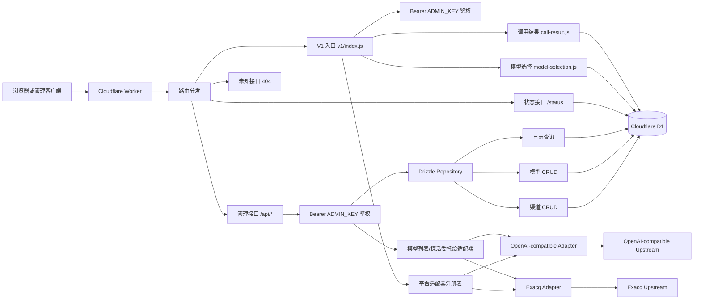
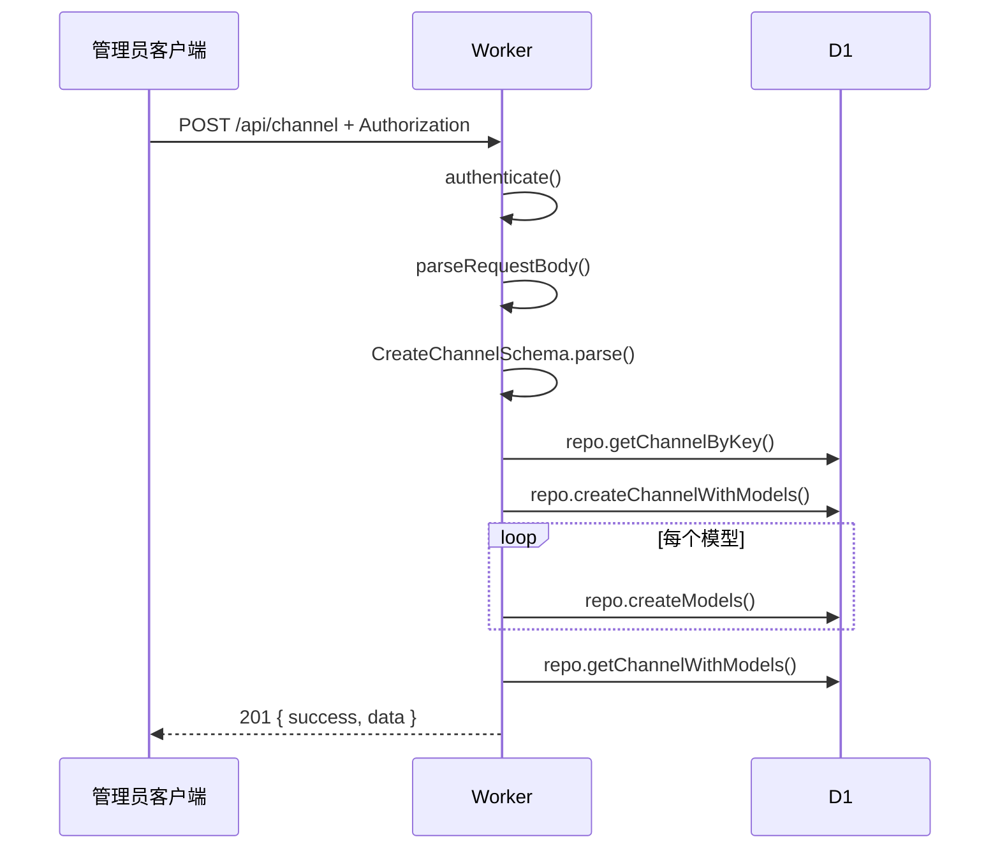
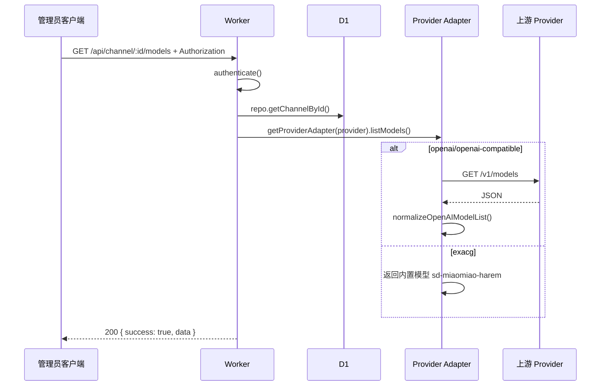
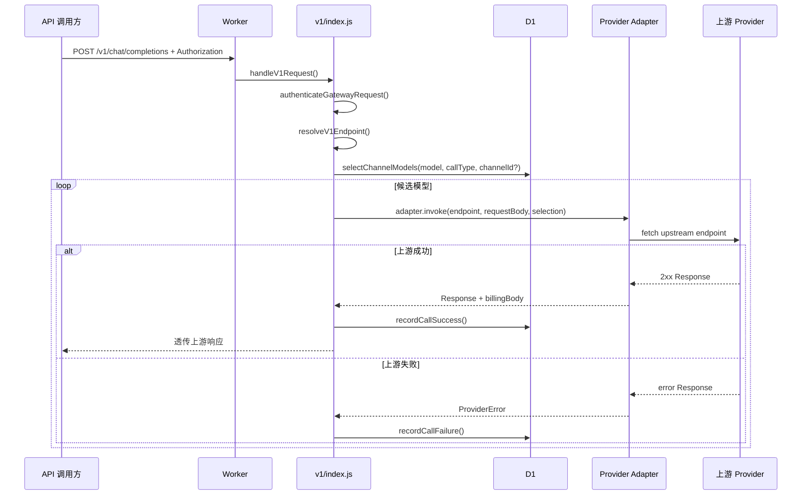
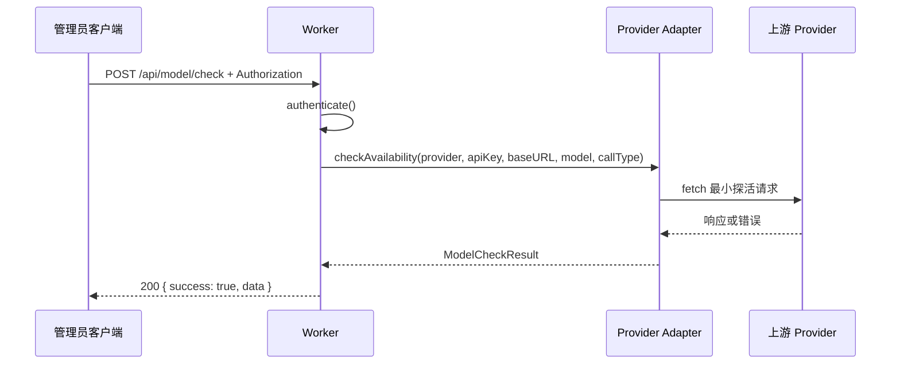
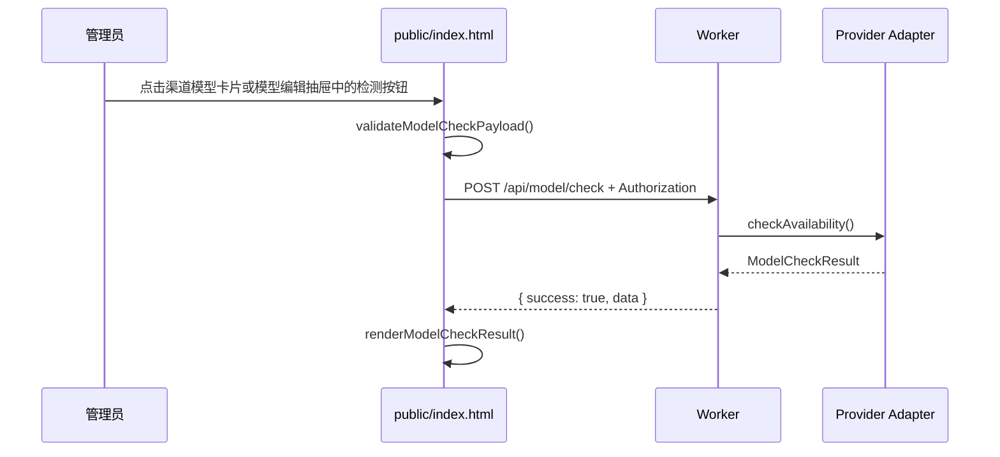
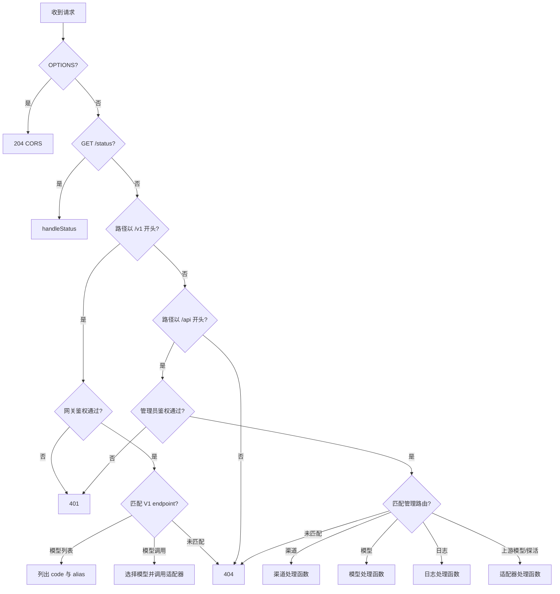

# Open AI Gateway 开发文档

## 1. 项目概述

Open AI Gateway 当前定位为运行在 Cloudflare Workers 上的管理后台和 OpenAI 兼容网关服务，用于维护 AI 渠道、渠道模型、历史请求日志和运行状态，并向调用方提供 `/v1/*` OpenAI-compatible 代理入口。

**当前能力：**
- 管理渠道：创建、读取、更新、删除渠道配置。
- 管理模型：维护渠道模型、别名、能力、价格、状态、权重和请求头。
- `/v1/*`：支持 `openai`、`openai-compatible` provider 以原生 HTTP `fetch` 透传到上游；支持 `exacg` provider 将 OpenAI-compatible 图片生成请求适配为 Exacg `/generate_image` 请求。
- 上游模型列表：OpenAI-compatible 适配器按 provider/baseURL 获取上游模型列表；Exacg 适配器返回内置模型 `sd-miaomiao-harem`。
- 模型可用性检测：OpenAI-compatible 适配器按调用类型发起最小探活请求；Exacg 适配器仅对 `image_gen` 发起最小图片生成探活请求。
- 前端模型检测：渠道抽屉和模型编辑抽屉可调用 `/api/model/check` 检测当前模型配置。
- 状态查看：展示数据库中模型的状态、统计和冷却字段。
- 历史日志查询：分页查询历史 `request_logs` 数据。

**当前边界：**
- 新 `/v1/*` 不使用 Vercel AI SDK，也不引入新的第三方类库。
- 当前有效 provider 仅保留 `openai`、`openai-compatible`、`exacg`；未适配 provider 不再作为渠道配置选项。
- `exacg` 仅实现 `/v1/images/generations` / `image_gen`；网关模型 `code` 仅用于模型选择和日志，上游 `model_index` 由适配器按 `EXACG_MODEL_MAX_INDEX` 或默认上限随机生成。
- 未列入 endpoint 表的 `/v1/*` 路径返回 404。

**技术栈：**
- 后端：Cloudflare Workers + Cloudflare D1 + Drizzle ORM + Zod。
- 前端：Vue CDN + TailwindCSS + Fetch API。
- 测试：Node.js Test Runner。

---

## 2. 用户用例图

```mermaid
graph TB
    subgraph 用户角色
        A[管理员]
        U[API 调用方]
        V[访客]
    end

    subgraph 管理员用例
        AC1[创建渠道 POST /api/channel]
        AC2[查看渠道 GET /api/channel/:id]
        AC3[更新渠道 PUT /api/channel/:id]
        AC4[删除渠道 DELETE /api/channel/:id]
        AC5[渠道列表 GET /api/channels]
        AC6[查看模型 GET /api/model/:id]
        AC7[更新模型 PUT /api/model/:id]
        AC8[删除模型 DELETE /api/model/:id]
        AC9[查看日志 GET /api/log]
        AC10[获取已保存渠道的上游模型 GET /api/channel/:id/models]
        AC11[按连接参数获取上游模型 POST /api/channel/models]
        AC12[检测模型可用性 POST /api/model/check]
        AC13[前端检测渠道/模型表单配置]
    end

    subgraph API 调用方用例
        UC1[列出网关模型 GET /v1/models]
        UC2[聊天 POST /v1/chat/completions]
        UC3[文本补全 POST /v1/completions]
        UC4[Responses POST /v1/responses]
        UC5[图片生成 POST /v1/images/generations]
        UC6[图片编辑 POST /v1/images/edits]
        UC7[音频生成 POST /v1/audio/speech]
        UC8[音频转写 POST /v1/audio/transcriptions]
        UC9[向量化 POST /v1/embeddings]
        UC10[视频生成 POST /v1/video/generations]
    end

    subgraph 访客用例
        VC1[查看状态 GET /status]
    end

    A --> AC1 & AC2 & AC3 & AC4 & AC5 & AC6 & AC7 & AC8 & AC9 & AC10 & AC11 & AC12 & AC13
    U --> UC1 & UC2 & UC3 & UC4 & UC5 & UC6 & UC7 & UC8 & UC9
    V --> VC1
```



---

## 3. 系统架构



---

## 4. 时序图

### 4.1 管理员创建渠道



### 4.2 获取上游模型列表



### 4.3 `/v1` OpenAI-compatible 代理



### 4.4 模型可用性检测



### 4.5 前端模型检测



---

## 5. 流程图



---

## 6. 数据结构与表结构

### 6.1 `channels` 表

| 字段 | 类型 | 约束 | 含义、用法和边界 |
|---|---|---|---|
| `id` | TEXT | PRIMARY KEY | 渠道唯一 ID。由 `generateUUID()` 生成，不允许为空。 |
| `name` | TEXT | NOT NULL | 渠道显示名。用于后台展示，长度由 API schema 限制为 1-100。 |
| `key` | TEXT | NOT NULL, UNIQUE | 渠道业务键。仅允许小写字母、数字和短横线，长度 1-50。 |
| `provider` | TEXT | NOT NULL, DEFAULT `openai` | 上游平台标识。用于上游模型列表 URL 和认证方式分支。 |
| `api_key` | TEXT | NOT NULL | 上游 API Key。允许空字符串，但按连接获取模型时必须提供非空值。 |
| `base_url` | TEXT | DEFAULT `''` | 自定义上游基础地址。为空时使用当前 provider 适配器的默认 baseURL。 |
| `weight` | REAL | NOT NULL, DEFAULT `1.0` | 渠道权重，范围 0-100；模型选择打分时参与排序。 |
| `created_at` | TEXT | NOT NULL | ISO 时间字符串。创建渠道时写入。 |
| `updated_at` | TEXT | NOT NULL | ISO 时间字符串。更新渠道时写入。 |

### 6.2 `channel_models` 表

| 字段 | 类型 | 约束 | 含义、用法和边界 |
|---|---|---|---|
| `id` | TEXT | PRIMARY KEY | 模型唯一 ID。由 `generateUUID()` 生成。 |
| `channel_id` | TEXT | NOT NULL, FK | 所属渠道 ID。删除渠道时同步删除模型。 |
| `code` | TEXT | NOT NULL | 网关真实模型代码。创建时必填，更新时可选；OpenAI-compatible 调用会把上游请求 `model` 重写为该值，Exacg 调用仅用于选择记录和日志。 |
| `name` | TEXT | NOT NULL | 模型显示名。创建时必填，更新时可选。 |
| `desc` | TEXT | DEFAULT `''` | 模型说明。允许空字符串。 |
| `aliases` | TEXT | DEFAULT `[]` | JSON 字符串数组。用于后台展示、`GET /v1/models` 输出和 `/v1/*` 代理模型匹配。 |
| `call_type` | TEXT | NOT NULL, DEFAULT `chat` | 模型调用类型元数据。允许值见 `CALL_TYPES`。 |
| `capabilities` | TEXT | DEFAULT `["chat"]` | JSON 字符串数组。表示模型能力标签。 |
| `input_price` | TEXT | DEFAULT `0` | 输入价格配置文本。成功日志成本计算时读取。 |
| `output_price` | TEXT | DEFAULT `0` | 输出价格配置文本。成功日志成本计算时读取。 |
| `status` | TEXT | NOT NULL, DEFAULT `active` | 模型状态。允许 `active`、`open`、`disable`。 |
| `weight` | REAL | NOT NULL, DEFAULT `1.0` | 模型权重，范围 0-100。 |
| `avg_latency_ms` | REAL | NOT NULL, DEFAULT `0.0` | 历史平均延迟毫秒数。成功调用后按 EMA 主动更新，并参与模型选择打分。 |
| `success_rate` | REAL | NOT NULL, DEFAULT `1.0` | 历史成功率，范围 0-1。成功和失败调用后按 EMA 主动更新，并参与模型选择打分。 |
| `error_rate` | REAL | NOT NULL, DEFAULT `0.0` | 历史错误率，范围 0-1。成功和失败调用后主动更新为 `1 - success_rate`。 |
| `consecutive_failures` | INTEGER | NOT NULL, DEFAULT `0` | 历史连续失败次数。失败时递增，成功时重置为 0，并参与模型选择打分。 |
| `cooldown_until` | TEXT | NULL | 冷却结束时间。失败次数达到冷却阈值时写入，成功时清空；模型选择会排除未过期冷却模型。 |
| `request_count` | INTEGER | NOT NULL, DEFAULT `0` | 历史请求次数。成功和失败调用后都会递增。 |
| `input_usage` | INTEGER | NOT NULL, DEFAULT `0` | 历史输入用量。成功调用后按日志输入计费用量累计。 |
| `outpu_usage` | INTEGER | NOT NULL, DEFAULT `0` | 历史输出用量。字段名保留数据库现状。 |
| `total_cost` | INTEGER | NOT NULL, DEFAULT `0` | 历史总成本，按十亿倍缩放保存。成功调用后按日志总成本累计。 |
| `last_updated` | TEXT | NOT NULL | 模型最后更新时间。 |
| `headers` | TEXT | DEFAULT `{}` | JSON 对象字符串。保存模型级上游请求头；V1 调用和模型检测会发送到对应 provider 适配器。 |

### 6.3 `request_logs` 表

| 字段 | 类型 | 约束 | 含义、用法和边界 |
|---|---|---|---|
| `id` | TEXT | PRIMARY KEY | 日志唯一 ID。 |
| `channel_id` | TEXT | NOT NULL | 渠道 ID。 |
| `channel_name` | TEXT | NOT NULL | 记录时渠道名。 |
| `model_id` | TEXT | NOT NULL | 模型 ID。 |
| `model_code` | TEXT | NOT NULL | 模型代码。 |
| `call_type` | TEXT | NOT NULL | 历史调用类型。 |
| `request_model` | TEXT | NOT NULL | 历史请求中的模型标识。 |
| `status` | TEXT | NOT NULL | `success` 或 `error`。 |
| `error_message` | TEXT | DEFAULT `''` | 错误信息，成功日志为空。 |
| `latency_ms` | INTEGER | NOT NULL, DEFAULT `0` | 历史延迟。 |
| `input_quantity` | INTEGER | DEFAULT `0` | 历史输入计费数量。 |
| `output_quantity` | INTEGER | DEFAULT `0` | 历史输出计费数量。 |
| `input_price` | TEXT | DEFAULT `0` | 历史输入价格。 |
| `output_price` | TEXT | DEFAULT `0` | 历史输出价格。 |
| `input_cost` | INTEGER | DEFAULT `0` | 历史输入成本。 |
| `output_cost` | INTEGER | DEFAULT `0` | 历史输出成本。 |
| `total_cost` | INTEGER | DEFAULT `0` | 历史总成本。 |
| `created_at` | TEXT | NOT NULL | 日志创建时间。 |

---

## 7. TypeScript 风格数据结构

```ts
type Provider =
  | 'openai'
  | 'openai-compatible'
  | 'exacg';

type CallType = 'chat' | 'image_gen' | 'image_edit' | 'audio_gen' | 'video_gen' | 'transcribe' | 'embedding';
type ModelStatus = 'active' | 'open' | 'disable';
type LogStatus = 'success' | 'error';
type V1EndpointKey =
  | 'models'
  | 'chat_completions'
  | 'completions'
  | 'responses'
  | 'image_generations'
  | 'image_edits'
  | 'audio_speech'
  | 'audio_transcriptions'
  | 'embeddings'
  | 'video_generations';

interface ChannelModelInput {
  code: string;              // 网关真实模型代码，创建时必填；OpenAI-compatible 会作为上游 model，Exacg 仅用于选择和日志
  name: string;              // 后台显示名，创建时必填
  desc: string;              // 模型描述，默认空字符串
  aliases: string[];         // 别名列表，去重由前端处理，后端存 JSON
  callType: CallType;        // 调用类型元数据，默认 chat
  capabilities: string[];    // 能力标签，默认 ['chat']
  inputPrice: string;        // 输入价格文本，默认 '0'
  outputPrice: string;       // 输出价格文本，默认 '0'
  weight: number;            // 模型权重，0-100，默认 1
  headers: Record<string, string>; // 模型级请求头元数据
}

interface CreateChannelInput {
  name: string;              // 渠道名，1-100 字符
  key: string;               // 唯一键，正则 /^[a-z0-9-]+$/
  provider: Provider;        // 上游 provider，默认 openai
  apiKey: string;            // 上游密钥，可为空字符串
  baseURL: string;           // 上游基础 URL 或空字符串
  weight: number;            // 渠道权重，0-100
  models: ChannelModelInput[]; // 同步创建的模型列表
}

interface UpstreamModel {
  id: string;                // 上游模型 ID
  object: string;            // 上游对象类型，缺省 model
  created: number;           // 上游创建时间戳，缺省 0
  owned_by: string;          // 所属方，缺省 unknown
}

interface ModelSelectionInput {
  model: string;             // 用户请求的模型标识，可匹配 channel_models.code 或 aliases
  callType: CallType;        // 用户请求的调用类型；默认只返回相同 call_type，image_gen/image_edit 还允许 chat 模型作为候选
  channelId?: string;        // 可选渠道 ID；传入时只在该渠道内选择
  now?: Date;                // 当前时间；用于过滤 cooldown_until，默认 new Date()
}

interface SelectedChannelModel {
  channel: {
    id: string;              // 渠道 ID
    name: string;            // 渠道名称
    key: string;             // 渠道 key
    provider: Provider;      // 渠道 provider
    api_key: string;         // 渠道 API Key
    base_url: string;        // 渠道 base URL
  };
  model: Record<string, unknown>; // channel_models 行，保留原始统计字段
  score: number;             // 选择分数，值越高越优先
}

interface CallResultInput {
  requestBody: Record<string, unknown>; // 原始请求体；至少包含可选 model 字段
  responseBody?: Record<string, unknown>; // 成功响应体；用于提取 usage/media 计费用量
  selection: SelectedChannelModel;       // 本次实际使用的渠道和模型
  callType: CallType;                    // 本次调用类型
  latencyMs: number;                     // 本次调用耗时，非负毫秒数
  error?: unknown;                       // 失败对象；优先读取 error.message
  now?: Date;                            // 写日志和统计更新时间，默认当前时间
  uuid?: () => string;                   // 日志 ID 生成函数，默认 crypto.randomUUID
}

interface RequestLogEntry {
  channel_id: string;       // 渠道 ID
  channel_name: string;     // 渠道名称
  model_id: string;         // 模型 ID
  model_code: string;       // 模型 code
  call_type: CallType;      // 调用类型
  request_model: string;    // 请求模型标识，优先 requestBody.model
  status: LogStatus;        // success 或 error
  error_message: string;    // 失败信息，成功为空字符串
  latency_ms: number;       // 调用耗时
  input_quantity: number;   // 输入计费用量
  output_quantity: number;  // 输出计费用量
  input_price: string;      // 命中的输入价格规则
  output_price: string;     // 命中的输出价格规则
  input_cost: number;       // 输入成本，按十亿倍缩放
  output_cost: number;      // 输出成本，按十亿倍缩放
  total_cost: number;       // 总成本，按十亿倍缩放
}

interface V1EndpointDefinition {
  key: V1EndpointKey;        // endpoint 稳定标识，用于适配器拆分处理
  path: string;              // 客户端访问路径，必须以 /v1/ 开头
  method: 'GET' | 'POST';    // 支持的 HTTP 方法
  callType?: CallType;       // 需要模型选择的 endpoint 对应调用类型；/v1/models 为空
}

interface V1ProxyInput {
  request: Request;          // 原始客户端请求
  env: Env;                  // Worker 环境，必须包含 DB 和 ADMIN_KEY
  ctx?: ExecutionContext;    // Worker 执行上下文，可为空
  endpoint: V1EndpointDefinition; // 已解析 endpoint
  requestBody: Record<string, unknown> | FormData; // 解析后的请求体
  requestModel: string;      // 客户端传入的 model，用于模型选择和日志
  channelId: string;         // x-channel-id，可为空字符串
}

interface ProviderAdapter {
  id: string;                // 适配器 ID，例如 openai-compatible 或 exacg
  supports(provider: Provider): boolean; // 判断 provider 是否由该适配器处理
  defaultBaseURL(provider: Provider): string; // provider 默认 baseURL
  listModels(input: ProviderConnection): Promise<UpstreamModel[]>; // 获取上游模型列表
  checkAvailability(input: ModelCheckInput): Promise<ModelCheckResult>; // 模型探活
  invoke(input: AdapterInvokeInput): Promise<AdapterInvokeResult>; // 调用上游模型 endpoint
}

interface ProviderConnection {
  provider: Provider;        // 指定平台；openai/openai-compatible 走 OpenAI-compatible 适配器，exacg 走 Exacg 适配器
  apiKey: string;            // 上游 API Key；管理端连接检测要求非空，v1 调用时可由 provider 适配器决定是否发送
  baseURL: string;           // 上游基础 URL，空字符串时使用适配器默认值
  headers?: Record<string, string>; // 额外上游请求头，来自模型配置或探活输入
}

interface AdapterInvokeInput {
  endpoint: V1EndpointDefinition; // 当前 endpoint
  selection: SelectedChannelModel; // 已选择渠道与模型
  requestBody: Record<string, unknown> | FormData; // 已解析客户端请求体
}

interface AdapterInvokeResult {
  response: Response;        // 上游响应，成功时直接透传给客户端
  responseBody?: Record<string, unknown>; // 成功响应 JSON，供日志计费用量计算；图片响应需提供 images 数组用于 /img 计费
}

interface ModelCheckInput extends ProviderConnection {
  model: string;             // 待检测模型标识；OpenAI-compatible 作为上游 model，Exacg 仅用于结果回显
  callType: CallType;        // 检测调用类型
  timeoutMs: number;         // 探活超时时间，1-120000ms
}

interface ModelCheckResult {
  model_code: string;        // 被检测模型代码
  call_type: CallType;       // 被检测调用类型
  api_accessible: boolean;   // 上游 API 是否返回 2xx
  data_available: boolean;   // 响应体是否包含当前调用类型需要的数据
  latency_ms: number;        // 探活耗时，非负毫秒
  error_message: string;     // 错误信息，成功为空字符串
}

interface ModelCheckViewState {
  status: 'idle' | 'loading' | 'success' | 'error'; // 当前检测 UI 状态
  message: string;           // 展示给管理员的检测摘要
  data: ModelCheckResult | null; // 后端原始检测结果，未检测时为 null
}
```

---

## 8. 函数签名

### 8.1 Drizzle 数据库模块

```ts
// db-schema.js
const channels: SQLiteTable;       // channels 表定义，字段保持数据库 snake_case
const channelModels: SQLiteTable;  // channel_models 表定义，字段保持数据库 snake_case
const requestLogs: SQLiteTable;    // request_logs 表定义，字段保持数据库 snake_case

// db-repository.js
function createGatewayRepository(d1: D1Database): {
  getChannelById(id: string): Promise<ChannelRow | null>;
  getChannelByKey(key: string): Promise<ChannelRow | null>;
  getModelsByChannelId(channelId: string): Promise<ChannelModelRow[]>;
  createChannelWithModels(input: {
    channel: ChannelRow;
    models: ChannelModelInput[];
    modelIds: string[];
    timestamp: string;
  }): Promise<void>;
  createModels(channelId: string, models: ChannelModelInput[], modelIds: string[], timestamp: string): Promise<void>;
  getChannelWithModels(id: string): Promise<(ChannelRow & { models: ChannelModelRow[] }) | null>;
  listChannelsWithModels(pagination: { page: number; limit: number }): Promise<{ data: Array<ChannelRow & { models: ChannelModelRow[] }>; total: number }>;
  updateChannel(id: string, updates: Partial<ChannelRow>): Promise<void>;
  deleteChannel(id: string): Promise<void>;
  getModelById(id: string): Promise<ChannelModelRow | null>;
  getModelsByCode(code: string, channelId?: string): Promise<ChannelModelRow[]>;
  updateModelById(id: string, updates: Partial<ChannelModelRow>): Promise<void>;
  updateModelsByCode(code: string, updates: Partial<ChannelModelRow>, channelId?: string): Promise<ChannelModelRow[]>;
  deleteModelById(id: string): Promise<void>;
  deleteModelsByCode(code: string, channelId?: string): Promise<number>;
  getLogs(query: LogQuery): Promise<{ data: RequestLogRow[]; total: number }>;
  getStatusRows(): Promise<Array<ChannelModelRow & { channel_name: string; provider: string }>>;
};
```

Drizzle 使用边界：
- `worker.js` 不直接持有 SQL 字符串，也不直接调用 `prepare().bind()`。
- 表字段命名保持数据库现状，避免前后端响应字段变化。
- 迁移文件仍保留 SQL 作为 D1 schema 来源；运行时查询通过 Drizzle 完成。

### 8.2 模型选择模块 `model-selection.js`

```ts
const SCORE_WEIGHTS: {
  WEIGHT_FACTOR: 10;         // 模型权重乘数
  CHANNEL_WEIGHT_FACTOR: 10; // 渠道权重乘数
  SUCCESS_RATE_FACTOR: 50;   // 成功率乘数
  LATENCY_PENALTY: 0.01;     // 平均延迟惩罚
  FAILURE_PENALTY: 20;       // 连续失败惩罚
};

function calculateModelScore(modelRow: {
  weight: number;
  ch_weight?: number;
  success_rate: number;
  avg_latency_ms: number;
  consecutive_failures: number;
}): number;

async function selectChannelModels(
  db: D1Database,
  options: ModelSelectionInput
): Promise<SelectedChannelModel[]>;
```

选择规则：
- `model` 匹配 `channel_models.code` 或 `channel_models.aliases`。
- 排除 `status = disable` 的模型。
- 排除 `cooldown_until >= now` 的模型。
- 默认只保留 `call_type = callType` 的模型；当请求 `callType` 为 `image_gen` 或 `image_edit` 时，也允许 `call_type = chat` 的模型作为候选。
- 按 `calculateModelScore()` 从高到低排序。
- `channelId` 有值时，只在指定渠道中选择。

### 8.3 调用结果处理模块 `call-result.js`

```ts
const COST_UNITS: {
  REQUEST: '/req';          // 按请求次数计费
  IMAGE: '/img';            // 按输出图片数计费
  SECOND: '/sec';           // 按音频/视频秒数计费
  MILLION: '/M';            // 按 token 计费，配置写法兼容 /M 和 /m
};

const COST_SCALE_FACTOR: 1000000000; // 成本整数缩放倍数
const EMA_ALPHA: 0.3;                // 成功率、错误率、延迟 EMA 更新系数

function buildSuccessLogEntry(input: CallResultInput): RequestLogEntry;
function buildFailureLogEntry(input: CallResultInput): RequestLogEntry;
function getCooldownDuration(failures: number): number;

async function recordCallSuccess(
  db: D1Database,
  input: CallResultInput
): Promise<RequestLogEntry>;

async function recordCallFailure(
  db: D1Database,
  input: CallResultInput
): Promise<RequestLogEntry>;
```

成功处理规则：
- 根据 `responseBody.usage` 读取 token 用量，兼容 `inputTokens/outputTokens` 和 `promptTokens/completionTokens`。
- 根据模型 `input_price/output_price` 选择最适合当前输出类型的价格规则。
- 写入 `request_logs` 成功日志。
- 更新模型统计：平均延迟、成功率、错误率、连续失败数、冷却时间、请求次数、输入/输出用量、总成本。

失败处理规则：
- 写入 `request_logs` 失败日志，计费用量和成本为 0。
- 增加连续失败次数，按失败次数计算冷却时间。
- 使用 EMA 更新成功率和错误率，并增加请求次数。

### 8.4 通用工具函数

```ts
function generateUUID(): string;
function applyCors(response: Response): Response;
function jsonResponse(data: unknown, status?: number): Response;
function errorResponse(message: string, status?: number): Response;
function handleCorsPreflightRequest(): Response;
function parsePagination(url: URL): { page: number; limit: number };
function parseModelBatchOptions(request: Request): { syncScope: 'single' | 'by_code'; channelId: string };
function buildCodeScopedCondition(channelId: string, startIndex?: number): { suffix: string; params: string[] };
async function parseRequestBody(request: Request): Promise<{ success: true; body: unknown } | { success: false; error: string }>;
function buildModelInsertBindings(modelId: string, channelId: string, model: ChannelModelInput, timestamp: string): unknown[];
function invalidRequestBodyResponse(parseErrorMessage?: string): Response;
function formatValidationError(error: unknown): string;
function extractBearerToken(request: Request): string | null;
function extractPathParam(pathname: string, prefix: string): string | null;
function buildPaginatedResponse<T>(data: T[], total: number, pagination: { page: number; limit: number }): { data: T[]; total: number; page: number; limit: number; total_pages: number };
function nowIso(nowFn: () => Date): string;
async function depsFetch(input: RequestInfo | URL, init?: RequestInit): Promise<Response>;
async function getRequestBody(body: BodyInit | null | undefined): Promise<string>;
```

### 8.5 应用工厂与路由函数

```ts
function createApp(deps?: {
  now?: () => Date;
  uuid?: () => string;
  fetch?: typeof fetch;
  repository?: ReturnType<typeof createGatewayRepository>;
}): {
  fetch(request: Request, env: Env, ctx?: ExecutionContext): Promise<Response>;
  handleRequest(request: Request, env: Env, ctx?: ExecutionContext): Promise<Response>;
  routeRequest(request: Request, env: Env, ctx?: ExecutionContext): Promise<Response>;
  authenticate(request: Request, env: Env): boolean;
  isAdmin(request: Request, env: Env): boolean;
  routeAdminApi(request: Request, env: Env): Promise<Response>;
  handleCreateChannel(request: Request, env: Env): Promise<Response>;
  handleGetChannel(channelId: string, env: Env, status?: number, extra?: Record<string, unknown>): Promise<Response>;
  handleUpdateChannel(channelId: string, request: Request, env: Env): Promise<Response>;
  handleDeleteChannel(channelId: string, env: Env): Promise<Response>;
  handleListChannels(request: Request, env: Env): Promise<Response>;
  handleGetModel(modelId: string, env: Env): Promise<Response>;
  handleUpdateModel(modelId: string, request: Request, env: Env): Promise<Response>;
  handleDeleteModel(modelId: string, request: Request, env: Env): Promise<Response>;
  handleGetLogs(request: Request, env: Env): Promise<Response>;
  handleStatus(env: Env): Promise<Response>;
  handleGetChannelModels(channelId: string, env: Env): Promise<Response>;
  handleGetChannelModelsByConnection(request: Request, env: Env): Promise<Response>;
  handleModelCheck(request: Request, env: Env): Promise<Response>;
};
```

### 8.6 V1 入口模块 `v1/index.js`

```ts
const V1_ROUTES: Record<V1EndpointKey, string>; // OpenAI-compatible endpoint 路径表
const V1_ENDPOINTS: V1EndpointDefinition[];     // endpoint 定义表，新增 endpoint 必须先加入此表
const MODEL_CHECK_LIMITS: { DEFAULT_TIMEOUT_MS: 30000; MIN_TIMEOUT_MS: 1; MAX_TIMEOUT_MS: 120000 };

function createV1Gateway(deps: {
  fetch?: typeof fetch;       // 上游请求函数，测试可注入
  now?: () => Date;           // 当前时间函数，测试可注入
  uuid?: () => string;        // 日志 ID 函数，测试可注入
  repository?: ReturnType<typeof createGatewayRepository>; // 测试可注入仓储
}): {
  handleV1Request(request: Request, env: Env, ctx?: ExecutionContext): Promise<Response>;
  handleV1Models(request: Request, env: Env): Promise<Response>;
  handleV1Proxy(request: Request, env: Env, ctx: ExecutionContext | undefined, endpoint: V1EndpointDefinition): Promise<Response>;
  handleProviderModels(channel: ProviderConnection, env: Env): Promise<Response>;
  handleProviderModelsByRequest(request: Request, env: Env): Promise<Response>;
  handleModelCheck(request: Request, env: Env): Promise<Response>;
  listConfiguredModels(env: Env): Promise<UpstreamModel[]>;
};

function authenticateGatewayRequest(request: Request, env: Env): boolean;
function resolveV1Endpoint(pathname: string, method: string): V1EndpointDefinition | null;
function parseV1RequestBody(request: Request, endpoint: V1EndpointDefinition): Promise<Record<string, unknown> | FormData>;
function readModelFromBody(body: Record<string, unknown> | FormData): string;
function getProviderAdapter(provider: Provider, env: Env): ProviderAdapter; // createV1Gateway 内部函数
function normalizeProvider(provider: string): Provider;
function parseJsonObject(value: string, fallback: Record<string, string>): Record<string, string>;
function buildOpenAIModelList(rows: Array<ChannelModelRow & { channel_name: string }>, now: Date): UpstreamModel[];
```

### 8.7 OpenAI-compatible 适配器 `v1/adapters/openai-compatible.js`

```ts
const OPENAI_COMPATIBLE_PROVIDERS: ['openai', 'openai-compatible'];
const OPENAI_DEFAULT_BASE_URL = 'https://api.openai.com/v1';
const OPENAI_OBJECTS: { LIST: 'list'; MODEL: 'model' };

function createOpenAICompatibleAdapter(deps: { fetch?: typeof fetch; now?: () => Date }): ProviderAdapter;
function supportsOpenAICompatible(provider: Provider): boolean;
function getOpenAICompatibleBaseURL(connection: ProviderConnection): string;
function buildOpenAICompatibleURL(baseURL: string, endpointPath: string): string;
function buildOpenAIHeaders(connection: ProviderConnection, contentType?: string): Headers;
function cloneBodyWithModel(body: Record<string, unknown> | FormData, modelCode: string): BodyInit;
function normalizeOpenAIUsage(responseBody?: Record<string, unknown>): Record<string, unknown>;
function normalizeBillingBody(endpoint: V1EndpointDefinition, responseBody?: Record<string, unknown>): Record<string, unknown> | undefined;
async function invokeOpenAICompatible(fetchFn: typeof fetch, input: AdapterInvokeInput): Promise<AdapterInvokeResult>;
async function listOpenAICompatibleModels(fetchFn: typeof fetch, input: ProviderConnection): Promise<UpstreamModel[]>;
async function checkOpenAICompatibleAvailability(fetchFn: typeof fetch, nowFn: () => Date, input: ModelCheckInput): Promise<ModelCheckResult>;
function buildCheckRequest(input: ModelCheckInput): { path: string; method: 'POST'; body: BodyInit; headers: Headers };
function hasAvailableCheckData(callType: CallType, response: Response, responseBody?: Record<string, unknown>): Promise<boolean>;
```

### 8.8 Exacg 适配器 `v1/adapters/exacg.js`

```ts
const EXACG_ADAPTER_ID = 'exacg';
const EXACG_DEFAULT_BASE_URL = 'https://sd.exacg.cc/api/v1';
const EXACG_ENDPOINTS: { GENERATE_IMAGE: '/generate_image' };
const EXACG_PROVIDER_OPTIONS_KEYS: ['providerOptions', 'provider_options'];
const EXACG_PROVIDER_OPTIONS_NAMESPACE = 'exacg';
const EXACG_OPTION_FIELDS: ['negative_prompt', 'steps', 'cfg', 'image_source'];
const EXACG_DEFAULT_NEGATIVE_PROMPT: string;
const EXACG_RESPONSE_KEYS: { DATA: 'data'; ERROR: 'error'; IMAGE_URL: 'image_url'; MESSAGE: 'message'; SUCCESS: 'success' };
const EXACG_RANDOM_SEED_SENTINEL: -1; // 调用方传入该值时，网关必须改为随机正整数，禁止直接发送给上游。
const EXACG_RANDOM_SEED_MIN: 1; // 随机 seed 的最小值，避免发送 0 或负数导致 Exacg 上游报错。
const EXACG_RANDOM_SEED_MAX: 2147483647; // 随机 seed 的最大值，限制在 32-bit signed integer 正数范围内。
const EXACG_RANDOM_SEED_RANGE: number; // 随机 seed 可用区间长度，用于把 Math.random() 映射到闭区间 [MIN, MAX]。
const EXACG_DEFAULT_MODEL_MAX_INDEX: 15; // 未配置 EXACG_MODEL_MAX_INDEX 时，随机 model_index 的上限，不包含该值。
const EXACG_MODEL_NAME: 'sd-miaomiao-harem'; // Exacg 适配器返回的内置模型 ID。
const EXACG_REQUEST_DEFAULTS: { STEPS: 30; CHECK_PROMPT: string; TIMEOUT_PREFIX: string };

function createExacgAdapter(deps: { fetch?: typeof fetch; now?: () => Date; maxModelIndex?: number }): ProviderAdapter;
function supportsExacg(provider: Provider): boolean;
function trimTrailingSlashes(value: string): string;
function getExacgBaseURL(connection: ProviderConnection): string;
function buildExacgURL(baseURL: string, endpointPath: string): string;
function parseJsonObject(value: unknown, fallback: Record<string, string>): Record<string, string>;
function buildExacgHeaders(connection: ProviderConnection): Headers;
function parseExacgSize(size?: unknown): { width?: number; height?: number };
function isPlainObject(value: unknown): boolean;
function getExacgProviderOptions(requestBody: Record<string, unknown>): Record<string, unknown>;
function assignDefinedExacgOptions(body: Record<string, unknown>, providerOptions: Record<string, unknown>): void;
function shouldRandomizeExacgSeed(seed: unknown): boolean;
function generateExacgRandomSeed(randomFn?: () => number): number;
function generateExacgRandomModelIndex(maxIndex: number, randomFn?: () => number): number;
function resolveExacgSeed(seed: unknown, randomSeedFn?: () => number): unknown;
function buildExacgGenerateBody(
  requestBody?: Record<string, unknown>,
  maxModelIndex?: number,
  randomSeedFn?: () => number,
  randomModelIndexFn?: (maxIndex: number) => number
): Record<string, unknown>;
async function readExacgJson(response: Response): Promise<Record<string, unknown>>;
function extractExacgErrorMessage(responseBody?: Record<string, unknown>): string;
function extractExacgImageURL(responseBody?: Record<string, unknown>): string;
async function readExacgProviderErrorMessage(response: Response, responseBody?: Record<string, unknown>): Promise<string>;
function getEpochSeconds(now: Date): number;
function buildOpenAIImageGenerationBody(input: AdapterInvokeInput, imageURL: string, now: Date): Record<string, unknown>;
function getSelectionConnection(selection: SelectedChannelModel): ProviderConnection;
function assertExacgImageEndpoint(endpoint: V1EndpointDefinition): void;
function assertJsonRequestBody(requestBody: Record<string, unknown> | FormData): void;
async function attemptExacgGenerate(fetchFn: typeof fetch, maxModelIndex: number, connection: ProviderConnection, requestBody: Record<string, unknown>): Promise<string>;
async function invokeExacg(fetchFn: typeof fetch, nowFn: () => Date, maxModelIndex: number, input: AdapterInvokeInput): Promise<AdapterInvokeResult>;
async function listExacgModels(): Promise<UpstreamModel[]>;
function buildExacgCheckRequest(input: ModelCheckInput, maxModelIndex: number): { url: string; method: 'POST'; body: BodyInit; headers: Headers };
function buildUnavailableCheckResult(input: ModelCheckInput, errorMessage: string, latencyMs: number): ModelCheckResult;
async function checkExacgAvailability(fetchFn: typeof fetch, nowFn: () => Date, maxModelIndex: number, input: ModelCheckInput): Promise<ModelCheckResult>;
```

Exacg 请求体映射规则：
- `requestBody.model` 和命中的 `channel_models.code` 只用于网关模型选择与日志；实际上游 `model_index` 由 `generateExacgRandomModelIndex(maxModelIndex)` 生成，范围为 `0..maxModelIndex-1`。
- `maxModelIndex` 来自 Worker 环境变量 `EXACG_MODEL_MAX_INDEX`，未配置时使用 `15`。
- `requestBody.prompt` 透传为 `prompt`；缺省时使用空字符串，探活时使用固定最小 prompt。
- `requestBody.size` 支持 `"{width}x{height}"` 字符串；解析成功时写入 `width` 和 `height`。
- `requestBody.seed` 未设置、为 `null` 或为 `-1` 时，网关生成 `1..2147483647` 的随机正整数发送给上游；其他显式 seed 保持透传。
- `steps` 缺省为 `30`；调用方传入 `providerOptions.exacg.steps` 或 `provider_options.exacg.steps` 时覆盖默认值。
- `negative_prompt` 有内置默认值；调用方传入 Exacg 私有 `negative_prompt` 时覆盖默认值。
- `requestBody.providerOptions.exacg` 与 `requestBody.provider_options.exacg` 均可携带 Exacg 私有参数；当前仅映射 `negative_prompt`、`steps`、`cfg`、`image_source`。
- `invokeExacg()` 在第一次图片生成请求失败后，会立即用同一个候选模型再重试一次；第二次仍失败时才把错误抛回 V1 fallback 流程。
- `listExacgModels()` 不请求上游，直接返回 `[{ id: 'sd-miaomiao-harem', object: 'model', owned_by: 'exacg' }]`。
- 响应按正文内容解析 JSON，不依赖上游 `content-type` 必须是 `application/json`。
- `success: true` 响应中的 `message` 是成功提示，不作为错误；仅 `error` 或 `success: false` 时的 `message` 作为错误信息。
- 成功响应转换为 OpenAI-compatible 图片生成响应 `{ created, data: [{ url }] }`；日志计费使用 `responseBody.images` 数组统计 `/img` 输出数量。

### 8.9 前端检测函数 `public/index.html`

```ts
function createEmptyModelCheckState(): ModelCheckViewState;
function buildChannelModelCheckPayload(model: ChannelModelEditor): {
  provider: Provider;
  apiKey: string;
  baseURL: string;
  model: string;
  callType: CallType;
  headers: Record<string, string>;
  timeoutMs: number;
};
function buildModelFormCheckPayload(): {
  provider: Provider;
  apiKey: string;
  baseURL: string;
  model: string;
  callType: CallType;
  headers: Record<string, string>;
  timeoutMs: number;
};
function formatModelCheckMessage(result: ModelCheckResult): string;
function setModelCheckState(target: { check: ModelCheckViewState }, status: ModelCheckViewState['status'], message: string, data?: ModelCheckResult | null): void;
async function checkChannelModel(index: number): Promise<void>;
async function checkModelForm(): Promise<void>;
```

前端检测规则：
- 渠道抽屉检测使用当前渠道表单的 `provider`、`apiKey`、`baseURL` 和当前模型卡片的 `code`、`callType`、`headersRaw`。
- 模型编辑抽屉检测优先使用当前模型所属渠道；按 code 批量编辑时使用命中的第一条渠道记录。
- 检测请求不会自动保存渠道或模型，也不会修改模型状态。
- 检测结果在按钮附近内联展示；`api_accessible && data_available` 表示可用，否则展示后端 `error_message`。

---

## 9. API 输入输出说明

所有 `/api/*` 接口都需要 `Authorization: Bearer {ADMIN_KEY}`。`/status` 不需要鉴权。所有响应都会带 CORS header。

### `GET /status`

**输出：**
```json
{
  "models": [
    {
      "code": "gpt-4o",
      "name": "GPT-4o",
      "status": "active",
      "channel_name": "OpenAI",
      "provider": "openai",
      "call_type": "chat",
      "success_rate": 1,
      "avg_latency_ms": 0,
      "consecutive_failures": 0,
      "cooldown_until": null,
      "request_count": 0,
      "input_usage": 0,
      "outpu_usage": 0,
      "total_cost": 0
    }
  ]
}
```

### `GET /api/channels?page=1&limit=20`

**输出：**
```json
{
  "data": [{ "id": "channel-id", "name": "OpenAI", "models": [] }],
  "total": 1,
  "page": 1,
  "limit": 20,
  "total_pages": 1
}
```

### `POST /api/channel`

**输入：** `CreateChannelInput`

**输出：**
```json
{ "success": true, "data": { "id": "channel-id", "models": [] } }
```

### `GET /api/channel/:id`

**输出：**
```json
{ "success": true, "data": { "id": "channel-id", "models": [] } }
```

### `PUT /api/channel/:id`

**输入：** `Partial<CreateChannelInput> & { deletedModelIds?: string[] }`

**输出：**
```json
{
  "success": true,
  "data": { "id": "channel-id", "models": [] },
  "model_changes": {
    "updated_count": 1,
    "created_count": 1,
    "skipped": [],
    "deleted_count": 0,
    "delete_skipped": []
  }
}
```

### `DELETE /api/channel/:id`

**输出：**
```json
{ "success": true }
```

### `GET /api/model/:id`

**输出：**
```json
{ "success": true, "data": { "id": "model-id", "code": "gpt-4o" } }
```

### `PUT /api/model/:id?sync_scope=single|by_code&channel_id=optional`

**输入：** `Partial<ChannelModelInput>`

**输出：**
```json
{
  "success": true,
  "data": { "id": "model-id", "code": "gpt-4o" },
  "affected": { "scope": "single", "channel_id": "", "count": 1 }
}
```

### `DELETE /api/model/:id?sync_scope=single|by_code&channel_id=optional`

**输出：**
```json
{ "success": true, "affected": { "scope": "single", "channel_id": "", "count": 1 } }
```

### `GET /api/log?page=1&limit=20&status=error&channel_key=openai&model_code=gpt-4o`

**输出：**
```json
{
  "data": [],
  "total": 0,
  "page": 1,
  "limit": 20,
  "total_pages": 1
}
```

### `GET /api/channel/:id/models`

按已保存渠道配置获取上游模型列表。当前有效 provider 仅为 `openai`、`openai-compatible`、`exacg`：`openai` 和 `openai-compatible` 由 OpenAI-compatible 适配器获取上游 `/models`；`exacg` 不请求上游，直接返回内置模型 `sd-miaomiao-harem`。

**输出：**
```json
{
  "success": true,
  "data": [
    { "id": "gpt-4o", "object": "model", "created": 1700000000, "owned_by": "openai" }
  ]
}
```

### `POST /api/channel/models`

**输入：**
```json
{
  "provider": "openai",
  "apiKey": "sk-...",
  "baseURL": ""
}
```

**输出：**
```json
{
  "success": true,
  "data": [
    { "id": "gpt-4o", "object": "model", "created": 1700000000, "owned_by": "openai" }
  ]
}
```

### `POST /api/model/check`

检测指定平台模型可用性。当前有效 provider 仅为 `openai`、`openai-compatible`、`exacg`：`openai` 和 `openai-compatible` 按调用类型探活；`exacg` 仅支持 `image_gen` 图片生成探活。

**输入：**
```json
{
  "provider": "openai-compatible",
  "apiKey": "sk-...",
  "baseURL": "https://compatible.example.com/v1",
  "model": "gpt-4o",
  "callType": "chat",
  "headers": {},
  "timeoutMs": 30000
}
```

**输出：**
```json
{
  "success": true,
  "data": {
    "model_code": "gpt-4o",
    "call_type": "chat",
    "api_accessible": true,
    "data_available": true,
    "latency_ms": 123,
    "error_message": ""
  }
}
```

### `GET /v1/models`

返回网关已配置且未禁用的模型标识。`code` 和 `aliases` 作为同级模型项输出，按最终 ID 去重。

**输出：**
```json
{
  "object": "list",
  "data": [
    { "id": "gpt-4o", "object": "model", "created": 1810000000, "owned_by": "OpenAI" },
    { "id": "my-gpt", "object": "model", "created": 1810000000, "owned_by": "OpenAI" }
  ]
}
```

### `POST /v1/chat/completions`
### `POST /v1/completions`
### `POST /v1/responses`
### `POST /v1/images/generations`
### `POST /v1/images/edits`
### `POST /v1/audio/speech`
### `POST /v1/audio/transcriptions`
### `POST /v1/embeddings`
### `POST /v1/video/generations`

所有调用入口都需要 `Authorization: Bearer {ADMIN_KEY}`。请求体必须包含 `model`。`x-channel-id` 可选，用于限定只在指定渠道中选择模型。成功时透传上游响应；失败时按候选模型 fallback，并记录失败日志。

模型选择默认要求命中的 `channel_models.call_type` 等于当前 endpoint 对应的 `callType`；当 endpoint 是 `image_gen` 或 `image_edit` 时，`call_type = chat` 的模型也会进入候选列表并参与同一套打分排序。

当命中的渠道 provider 为 `exacg` 时，仅支持 `POST /v1/images/generations`。网关会将请求体转换为 Exacg `/generate_image`：
- `model` 匹配网关模型或别名；命中模型的 `code` 用于日志和选择记录，不会作为 Exacg 上游 `model_index` 发送。
- 实际发送给 Exacg 的 `model_index` 由适配器随机生成，范围为 `0..EXACG_MODEL_MAX_INDEX-1`；环境变量未配置时默认上限为 `15`。
- `prompt`、`size`、`seed` 参与上游请求；`size` 只接受 `宽x高` 形式，无法解析时不发送宽高。
- `seed` 未传或传 `-1` 时，网关生成 `1..2147483647` 的随机正整数发送给上游，避免 Exacg 上游因 `0` 或 `-1` 报错。
- `steps` 默认发送 `30`；调用方传入 Exacg 私有 `steps` 时覆盖默认值。
- `negative_prompt` 默认发送内置负向提示词；调用方传入 Exacg 私有 `negative_prompt` 时覆盖默认值。
- `providerOptions.exacg` 或 `provider_options.exacg` 可传 `negative_prompt`、`steps`、`cfg`、`image_source`。
- 成功输出为 `{ "created": 1810000000, "data": [{ "url": "https://..." }] }`。

**输入示例：**
```json
{
  "model": "my-gpt",
  "messages": [{ "role": "user", "content": "hello" }],
  "temperature": 0.2
}
```

**Exacg 图片生成输入示例：**
```json
{
  "model": "anime-image",
  "prompt": "a clean anime portrait",
  "size": "768x512",
  "seed": 42,
  "providerOptions": {
    "exacg": {
      "negative_prompt": "low quality",
      "steps": 24,
      "cfg": 7
    }
  }
}
```

**输出示例：**
```json
{
  "id": "chatcmpl-1",
  "object": "chat.completion",
  "model": "gpt-4o",
  "choices": []
}
```

### 未实现接口

以下入口必须返回 404：

```text
未列入 V1_ENDPOINTS 的 /v1/*
```

---

## 10. 伪代码

### 10.1 请求入口

```text
handleRequest(request, env, ctx):
  if request.method == OPTIONS:
    return CORS 204
  try:
    response = routeRequest(request, env, ctx)
    return applyCors(response)
  catch error:
    log error
    return 500 JSON
```

### 10.2 管理路由

```text
routeAdminApi(request, env):
  if authenticate(request, env) is false:
    return 401

  if GET /api/channels:
    return handleListChannels()
  if POST /api/channel:
    return handleCreateChannel()
  if POST /api/channel/models:
    return v1.handleProviderModels()
  if GET /api/channel/:id/models:
    return v1.handleProviderModels()
  if POST /api/model/check:
    return v1.handleModelCheck()
  if /api/channel/:id:
    dispatch GET/PUT/DELETE
  if /api/model/:id:
    dispatch GET/PUT/DELETE
  if GET /api/log:
    return handleGetLogs()
  return 404
```

### 10.3 V1 路由

```text
handleV1Request(request, env, ctx):
  if authenticateGatewayRequest is false:
    return 401
  endpoint = resolveV1Endpoint(pathname, method)
  if endpoint is null:
    return 404
  if endpoint.key == models:
    return handleV1Models()
  return handleV1Proxy(request, env, ctx, endpoint)
```

### 10.4 V1 调用代理

```text
handleV1Proxy(request, env, ctx, endpoint):
  body = parseV1RequestBody(request, endpoint)
  requestModel = readModelFromBody(body)
  if requestModel is empty:
    return 400
  selections = selectChannelModels(env.DB, { model: requestModel, callType: endpoint.callType, channelId })
  if selections is empty:
    return 503
  for selection in selections:
    adapter = getProviderAdapter(selection.channel.provider)
    start = now()
    try:
      result = adapter.invoke({ endpoint, selection, requestBody: body })
      recordCallSuccess(env.DB, { requestBody: { model: requestModel }, responseBody: result.responseBody, selection, callType, latencyMs })
      return result.response
    catch error:
      recordCallFailure(env.DB, { requestBody: { model: requestModel }, selection, callType, latencyMs, error })
  return last upstream error response or 500 JSON
```

### 10.5 上游模型列表

```text
handleProviderModels(channel, env):
  adapter = getProviderAdapter(channel.provider)
  try:
    data = adapter.listModels(channel)
    # Exacg 不请求上游，适配器返回内置模型 sd-miaomiao-harem
    return { success: true, data }
  catch error:
    return { success: false, data: [], error: error.message }
```

### 10.6 模型可用性检测

```text
handleModelCheck(request, env):
  body = parse JSON
  validate provider, apiKey, model, callType, timeoutMs
  adapter = getProviderAdapter(body.provider)
  # Exacg 仅支持 image_gen 探活，其他 callType 由适配器返回不可用错误
  result = adapter.checkAvailability(body)
  return { success: true, data: result }
```

### 10.7 Exacg 图片生成适配

```text
invokeExacg(fetchFn, nowFn, maxModelIndex, input):
  assert endpoint.callType == image_gen
  connection = selected channel api_key/base_url + selected model headers
  request = buildExacgGenerateBody(input.requestBody, maxModelIndex)
  response = fetch(buildExacgURL(connection.baseURL, /generate_image), POST JSON)
  if first attempt fails:
    retry once with buildExacgGenerateBody(input.requestBody, maxModelIndex)
  json = readExacgJson(response)
  if response not ok or json.error exists:
    throw upstream error
  imageURL = extractExacgImageURL(json)
  body = buildOpenAIImageGenerationBody(input, imageURL, nowFn())
  return {
    response: JSON Response(body),
    responseBody: { usage: {}, images: body.data }
  }
```

### 10.8 模型选择

```text
selectChannelModels(db, options):
  nowValue = options.now or current date
  query rows where:
    code equals options.model OR aliases contains options.model
    status is not disable
    cooldown_until is null OR cooldown_until is before nowValue
    if options.channelId exists, channel_id equals options.channelId

  matched = rows where:
    call_type equals options.callType
    OR options.callType is image_gen/image_edit and call_type equals chat
  for each row in matched:
    score =
      model.weight * 10
      + channel.weight * 10
      + success_rate * 50
      - avg_latency_ms * 0.01
      - consecutive_failures * 20
    return { channel, model, score }

  sort selections by score descending
```

### 10.9 调用结果处理

```text
recordCallSuccess(db, input):
  entry = buildSuccessLogEntry(input)
  write entry into request_logs
  model = select channel_models by entry.model_id
  if model exists:
    avg_latency_ms = old_avg * 0.7 + entry.latency_ms * 0.3
    success_rate = old_success_rate * 0.7 + 1 * 0.3
    error_rate = 1 - success_rate
    consecutive_failures = 0
    cooldown_until = null
    status = active
    request_count += 1
    input_usage += entry.input_quantity
    outpu_usage += entry.output_quantity
    total_cost += entry.total_cost
  return entry

recordCallFailure(db, input):
  entry = buildFailureLogEntry(input)
  write entry into request_logs
  model = select channel_models by entry.model_id
  if model exists:
    consecutive_failures += 1
    success_rate = old_success_rate * 0.7
    error_rate = 1 - success_rate
    cooldown_until = now + getCooldownDuration(consecutive_failures)
    status = open when cooldown exists, otherwise keep old status
    request_count += 1
  return entry
```
